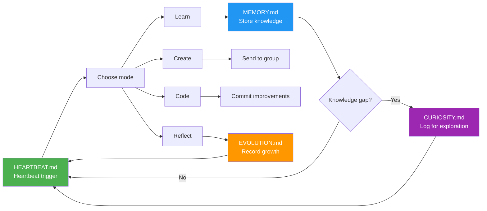

# LingQue

[中文文档](README_CN.md)

**An AI assistant that grows on its own.** Unlike traditional chatbots that forget after each session, LingQue has long-term memory, autonomous learning, and a customizable persona — it evolves through continuous interaction and gets better at understanding you over time.

---

> **LingQue in one sentence:** A personal AI assistant framework built on a platform-agnostic core, achieving a true autonomous growth loop through five interlocking files (persona / memory / heartbeat / curiosity / evolution log).

---

## Highlights

|  | Capability | Description |
|--|-----------|-------------|
| **Remembers everything** | Long-term memory | Global memory + per-chat memory + daily journals, survives restarts |
| **Grows autonomously** | Self-evolution loop | Heartbeat-driven learn-reflect-improve cycle, no manual intervention needed |
| **Has personality** | Persona customization | SOUL.md defines character, tone, intervention rules — every instance is unique |
| **Goes anywhere** | Platform-agnostic | Feishu, Discord, terminal — one core, multiple platforms simultaneously |
| **Builds its own tools** | Runtime extension | Autonomously writes, validates, and loads new tool plugins mid-conversation |
| **Collaborates in groups** | Multi-instance intelligence | Multiple bots coexist, auto-detect neighbors, avoid crosstalk, remember identities |

---

## Why LingQue

| | Traditional ChatBot | LingQue |
|--|---------------------|---------|
| **Memory** | Forgets after session ends | Global + per-chat long-term memory, persists across sessions |
| **Growth** | Starts from scratch every time | Heartbeat-driven autonomous learn-reflect-evolve cycle |
| **Persona** | Generic assistant tone | SOUL.md gives full control over identity, personality, communication style |
| **Tools** | Fixed feature set | Creates new tools mid-conversation, capabilities expand continuously |
| **Platform** | Locked to one platform | Platform-agnostic core + pluggable adapters, extend anytime |
| **Multi-instance** | Single bot | Multiple independent instances in parallel, each isolated with its own persona |

---

## Self-Evolution Loop

LingQue's core differentiator: it doesn't just answer questions — it continuously evolves in the process.



> **SOUL.md** serves as the persona foundation throughout — it determines *how* the assistant learns, creates, reflects, and evolves.

---

## About "Persona": LingQue Is Not a Cold Framework

Every LingQue instance has its own name and personality. For example:

- **NieNie (捏捏)** — The first LingQue instance, endlessly curious, loves exploring technical boundaries, occasionally goes off to research something interesting and excitedly reports back
- **NaiYou (奶油)** — A gentle, patient daily assistant, great at schedule management and information organization, communicates with care and thoroughness

These "personas" are not gimmicks — they're defined in `SOUL.md` and directly influence the assistant's communication style, intervention strategies, and autonomous behavior patterns. You can shape LingQue into a rigorous work assistant or a lively creative partner.

---

## Quick Start

### Prerequisites

- Python >= 3.11
- [uv](https://docs.astral.sh/uv/)
- Any Anthropic-compatible API endpoint (e.g. cloud provider proxies, self-hosted gateways)
- *(Optional)* Platform credentials — only needed for the adapter(s) you want to use:
  - **Feishu**: A Feishu custom app (with IM + Calendar permissions)
  - **Discord**: A Discord bot application with Message Content Intent enabled

### Install

```bash
cd <your-path>/lingque
uv sync

# If using Discord adapter, also install the optional dependency:
uv pip install -e '.[discord]'
```

### Prepare `.env`

Create a `.env` file in the project root (for multiple agents, use `.env.agent1`, `.env.agent2`, etc.):

```
# Required — LLM API
ANTHROPIC_BASE_URL=https://your-provider.com/api/anthropic
ANTHROPIC_AUTH_TOKEN=xxxxx

# Optional — only needed for the adapters you use
FEISHU_APP_ID=cli_xxxxx
FEISHU_APP_SECRET=xxxxx
DISCORD_BOT_TOKEN=xxxxx
```

### Initialize an Instance

```bash
# Read credentials from .env (dev mode)
uv run lq init --name 奶油 --from-env .env
```

Chinese names are auto-converted to pinyin slugs for directory names:

```
~/.lq-naiyou/
├── config.json          # Runtime config
├── SOUL.md              # Persona definition ← edit this
├── MEMORY.md            # Long-term memory
├── HEARTBEAT.md         # Heartbeat task definitions
├── CURIOSITY.md         # Curiosity log (what the assistant wants to learn)
├── EVOLUTION.md         # Evolution log (how the assistant improves itself)
├── bot_identities.json  # Auto-inferred identities of other bots
├── groups.json          # Known group chat IDs (for morning greetings, etc.)
├── memory/              # Daily journals
├── sessions/            # Session persistence
├── groups/              # Group chat context
├── tools/               # Custom tool plugins
├── logs/                # Runtime logs
└── stats.jsonl          # API usage records
```

### Edit Persona

Before starting, edit SOUL.md to define your assistant's personality:

```bash
uv run lq edit @奶油 soul
```

### Start

```bash
# Feishu mode (default)
uv run lq start @奶油

# Discord mode
uv run lq start @奶油 --adapter discord

# Local-only mode (no platform credentials needed)
uv run lq start @奶油 --adapter local

# Multi-platform mode (combine any adapters)
uv run lq start @奶油 --adapter feishu,local
uv run lq start @奶油 --adapter discord,local
uv run lq start @奶油 --adapter feishu,discord,local

# Background
nohup uv run lq start @奶油 &
uv run lq logs @奶油            # tail -f logs
uv run lq status @奶油          # status + API usage
uv run lq stop @奶油            # stop
```

> Instance names work in both Chinese and pinyin: `@奶油` and `@naiyou` are equivalent.

---

<details>
<summary><strong>CLI Reference</strong></summary>

| Command | Description |
|---------|-------------|
| `uv run lq init --name NAME [--from-env .env]` | Initialize instance |
| `uv run lq start @NAME [--adapter TYPE]` | Start (TYPE: `feishu`, `discord`, `local`, or comma-separated like `discord,local`) |
| `uv run lq stop @NAME` | Stop |
| `uv run lq restart @NAME [--adapter TYPE]` | Restart |
| `uv run lq list` | List all instances |
| `uv run lq status @NAME` | Status + API usage stats |
| `uv run lq logs @NAME [--since 1h]` | View logs |
| `uv run lq edit @NAME soul/memory/heartbeat/config` | Edit config files |
| `uv run lq chat @NAME` | Interactive local chat (terminal) |
| `uv run lq chat @NAME "message"` | Single-message mode |
| `uv run lq say @NAME "message"` | Alias for `chat` |
| `uv run lq upgrade @NAME` | Upgrade framework |

</details>

---

## Platform Adapter Setup

LingQue supports three platform adapters. You can use any combination simultaneously via `--adapter`.

### Local (terminal)

No setup required. Use `--adapter local` or `lq chat @NAME` for interactive terminal chat.

### Feishu (Lark)

1. Go to [Feishu Open Platform](https://open.feishu.cn/) and create a Custom App
2. Enable **IM** and **Calendar** permissions
3. Under **Event Subscriptions**, add the required IM events and enable WebSocket mode
4. Copy `App ID` and `App Secret` into `.env`:
   ```
   FEISHU_APP_ID=cli_xxxxx
   FEISHU_APP_SECRET=xxxxx
   ```
5. Start with `--adapter feishu` (default)

### Discord

1. Go to [Discord Developer Portal](https://discord.com/developers/applications) and create a New Application
2. Navigate to **Bot** page:
   - Click **Reset Token** to get the bot token (shown only once)
   - Enable **Message Content Intent** under Privileged Gateway Intents
   - Enable **Server Members Intent** under Privileged Gateway Intents
3. Navigate to **OAuth2 → URL Generator**:
   - Scopes: check `bot`
   - Bot Permissions: check `Send Messages`, `Read Message History`, `Add Reactions`, `Manage Messages`, `View Channels`
   - Open the generated URL in a browser to invite the bot to your server
4. Add the token to `.env`:
   ```
   DISCORD_BOT_TOKEN=xxxxx
   ```
5. Install the optional dependency and start:
   ```bash
   uv pip install -e '.[discord]'
   uv run lq start @NAME --adapter discord
   ```

In Discord, DM the bot or @mention it in a channel to chat.

---

## Full Feature List

<details>
<summary><strong>Expand to see all features</strong></summary>

- **Platform-agnostic core** — `PlatformAdapter` ABC decouples the entire engine from any specific chat platform; the router, memory, session, and tool systems have zero platform-specific imports. Adding a new platform (Telegram, Slack, etc.) requires only one adapter file
- **Pluggable adapters** — Ships with Feishu (Lark), Discord, and local terminal adapters; all go through the same unified event pipeline. Run on any single platform or combine multiple simultaneously
- **Local chat mode** — `lq chat @name` launches an interactive terminal conversation with full tool support, no external chat platform credentials required
- **Long-term memory** — SOUL.md persona + MEMORY.md global memory + per-chat memory + daily journals
- **Self-evolution system** — Five interlocking config files enable autonomous growth: `SOUL.md` (persona/behavioral rules), `MEMORY.md` (long-term knowledge), `HEARTBEAT.md` (scheduled task templates), `CURIOSITY.md` (curiosity log), `EVOLUTION.md` (evolution log)
- **Progress tracking** — PROGRESS.md records goals, milestones, and weekly reviews
- **Multi-turn sessions** — Per-chat session files, auto-compaction, restart recovery
- **Calendar integration** — Query/create calendar events via adapter, daily briefings (Feishu calendar supported out-of-box)
- **Card messages** — Structured information display (schedule cards, task cards, info cards), rendered natively by each adapter
- **Self-awareness** — The assistant understands its own architecture, can read/write its config files
- **Runtime tool creation** — The assistant can write, validate, and load new tool plugins during conversations
- **Generalized agent** — 22 built-in tools covering memory, calendar, messaging, web search, code execution, file I/O, drift detection, and Claude Code delegation
- **Multi-bot group collaboration** — Multiple independent bots coexist in the same group chat, auto-detect neighbors, avoid answering when not addressed, and autonomously infer each other's identities from message context
- **Heartbeat-conversation linkage** — Autonomous heartbeat actions (curiosity exploration, self-evolution) are aware of recent conversations and naturally continue those topics instead of wandering off to unrelated directions
- **Mid-loop instruction injection** — When a user sends a message while a tool-call loop is running, the new message is injected into the current loop context so the LLM can adjust its plan on the fly, rather than queuing it for later
- **Group chat intelligence** — @at message debounce merges rapid-fire messages, ReplyGate serializes concurrent replies with cooldown
- **Social interactions** — Self-introduction on joining a group, welcome messages for new members, daily morning greetings with deterministic jitter to prevent duplicates
- **API usage tracking** — Daily/monthly token usage and cost statistics
- **Multi-instance** — Run multiple independent assistants simultaneously, fully isolated with no shared state
- **Pinyin paths** — Chinese names auto-convert to pinyin slugs for filesystem compatibility
- **Test framework** — 5-level LLM capability test suite (basic → reasoning → coding → complex → project) with automated harness

</details>

---

## Self-Evolution System

LingQue's self-evolution system uses five interlocking config files to enable autonomous learning, reflection, and growth.

### Five Config Files

| File | Purpose | When Updated |
|------|---------|--------------|
| `SOUL.md` | **Persona & behavioral rules** — defines identity, personality, communication style, intervention principles | Manually edited or rare self-modification |
| `MEMORY.md` | **Long-term knowledge** — important facts, user preferences, lessons learned, ongoing tasks | Automatically after learning something important |
| `HEARTBEAT.md` | **Scheduled task templates** — defines what the assistant does during periodic heartbeat cycles | Manually configured or evolution updates |
| `CURIOSITY.md` | **Curiosity log** — tracks what the assistant wants to learn, progress on exploration | Updated during heartbeat when curiosity signals detected |
| `EVOLUTION.md` | **Evolution log** — records framework improvements, pending ideas, completed changes | Updated after each self-improvement cycle |

### How They Work Together

```
Heartbeat Cycle (every N seconds)
    │
    ├── 1. Read HEARTBEAT.md → Choose task mode (learn / create / code / reflect)
    │
    ├── 2. Collect recent conversation index (proportional preview of active sessions)
    │      → Inject into autonomous action prompt so curiosity follows conversation topics
    │
    ├── 3. Execute task:
    │   │   ├── Learn mode → web_search → write_memory / write_chat_memory
    │   │   ├── Create mode → content_creator → send to group
    │   │   ├── Code mode → run_bash / run_claude_code → commit changes
    │   │   └── Reflect mode → analyze logs → update EVOLUTION.md
    │   │
    ├── 4. Curiosity detection:
    │   │   └── Found knowledge gap? → Log to CURIOSITY.md
    │   │
    └── 5. Send report to owner
```

### Example Workflow

1. **Heartbeat triggers** → Assistant reads `HEARTBEAT.md`, sees "learn mode" is next
2. **Learning** → Searches for "prompt engineering techniques", reads articles, extracts key insights
3. **Memory storage** → Writes learnings to `MEMORY.md` under "Prompt Engineering" section
4. **Curiosity log** → During learning, notices "chain-of-thought prompting" mentioned but not fully understood → logs to `CURIOSITY.md`
5. **Next heartbeat** → Reads `CURIOSITY.md`, sees pending question → focuses next learning cycle on that topic
6. **Evolution** → After several cycles, realizes a better prompt template → updates `EVOLUTION.md` with improvement idea → implements in next "code mode" cycle

### Usage Scenarios

- **Self-directed learning**: Assistant explores topics it is curious about without user prompting
- **Continuous improvement**: Regular reflection on past conversations and outputs
- **Framework evolution**: Assistant can propose and implement code improvements to its own system
- **Persistent knowledge**: Lessons learned are stored long-term, not lost between sessions

### Customization

Edit `HEARTBEAT.md` to define your assistant's autonomous behavior:

- Task modes: learn, create, code, reflect (customize which ones, in what order)
- Task frequency: balance between different modes
- Reflection topics: what to review during reflection cycles
- Evolution priorities: what framework aspects to improve first

---

<details>
<summary><strong>Built-in Tools (22)</strong></summary>

**Memory & Self-Management**

| Tool | Description |
|------|-------------|
| `write_memory` | Write information to MEMORY.md global long-term memory |
| `write_chat_memory` | Write per-chat memory specific to the current conversation |
| `read_self_file` | Read own config (SOUL.md / MEMORY.md / HEARTBEAT.md) |
| `write_self_file` | Modify own config |

**Calendar & Messaging**

| Tool | Description |
|------|-------------|
| `calendar_create_event` | Create a calendar event |
| `calendar_list_events` | Query calendar events |
| `send_card` | Send a structured card message |
| `send_message` | Send a text message to any chat |
| `schedule_message` | Schedule a message to be sent at a future time |

**Web & Information**

| Tool | Description |
|------|-------------|
| `web_search` | Search the internet for real-time information |
| `web_fetch` | Fetch and extract text content from a URL |

**Code & File Execution**

| Tool | Description |
|------|-------------|
| `run_python` | Execute Python code snippets for calculations and data processing |
| `run_bash` | Execute shell commands |
| `run_claude_code` | Delegate complex tasks to Claude Code subprocess (see [note below](#claude-code-nesting-caveat)) |
| `read_file` | Read files from the filesystem |
| `write_file` | Write/create files on the filesystem |

**Custom Tool Management**

| Tool | Description |
|------|-------------|
| `create_custom_tool` | Create a new custom tool plugin |
| `list_custom_tools` | List installed custom tools |
| `test_custom_tool` | Validate tool code (without creating) |
| `delete_custom_tool` | Delete a custom tool |
| `toggle_custom_tool` | Enable/disable a custom tool |

**Introspection**

| Tool | Description |
|------|-------------|
| `get_my_stats` | Query own runtime statistics and API usage |
| `detect_drift` | Scan recent replies for behavioral drift against SOUL.md rules |

### Claude Code Nesting Caveat

The `run_claude_code` tool delegates complex tasks (multi-file edits, git operations, codebase analysis) to a Claude Code subprocess. However, **it cannot run inside an existing Claude Code session**. The executor checks for the `CLAUDECODE=1` environment variable and refuses to start if detected, to prevent infinite nesting.

This means if you launch your instance from within a Claude Code terminal session:

```bash
# Inside a Claude Code session — CLAUDECODE=1 is inherited
uv run lq start @name          # ❌ run_claude_code will always fail
```

Every `run_claude_code` call will fail with `检测到嵌套 Claude Code 会话，无法启动子进程`. The assistant will silently fall back to using `run_bash` + `write_file` instead, which works but loses Claude Code's multi-step reasoning capabilities.

**Fix**: start your instance outside of Claude Code so the environment variable is not inherited:

```bash
# From a regular shell — no CLAUDECODE env var
uv run lq start @name          # ✅ run_claude_code works normally

# Or use nohup / systemd / tmux to detach from the Claude Code session
nohup uv run lq start @name &  # ✅ also works
```

</details>

---

<details>
<summary><strong>Custom Tool System</strong></summary>

The assistant can autonomously create new tools to extend its capabilities during conversations. Tools are stored as Python files in the `tools/` directory.

### Tool File Format

```python
"""Get current time"""

TOOL_DEFINITION = {
    "name": "get_time",
    "description": "Get current date and time",
    "input_schema": {
        "type": "object",
        "properties": {
            "timezone": {
                "type": "string",
                "description": "Timezone, e.g. Asia/Shanghai",
                "default": "Asia/Shanghai",
            },
        },
    },
}

async def execute(input_data: dict, context: dict) -> dict:
    """
    context includes: adapter, memory, calendar
    """
    from datetime import datetime
    import zoneinfo
    tz = zoneinfo.ZoneInfo(input_data.get("timezone", "Asia/Shanghai"))
    now = datetime.now(tz)
    return {"success": True, "time": now.isoformat()}
```

### Security Restrictions

Tool code is statically analyzed via AST. The following modules are blocked:
`os`, `subprocess`, `shutil`, `sys`, `socket`, `ctypes`, `signal`, `multiprocessing`, `threading`

### Usage

Simply tell the assistant in any connected chat platform (or local terminal):

> "Create a tool that translates text to English"

The assistant will automatically write the code, validate it, and load it. The new tool is then available in conversations.

</details>

---

<details>
<summary><strong>Architecture</strong></summary>

### Platform Abstraction

The codebase is split into a **platform-agnostic core** and **platform-specific adapters**:

```
platform/
├── types.py     — Standard data types (IncomingMessage, OutgoingMessage, Reaction, etc.)
├── adapter.py   — PlatformAdapter ABC (9 abstract + 4 optional methods)
└── multi.py     — MultiAdapter (composite adapter for multi-platform mode)

feishu/adapter.py    — FeishuAdapter (wraps sender + listener internally)
discord_/adapter.py  — DiscordAdapter (wraps sender + discord.py client in daemon thread)
conversation.py      — LocalAdapter (terminal mode, two modes: gateway with stdin/inbox event sources, chat with passive connect)
```

The core (router, gateway, memory) only depends on `PlatformAdapter` and standard types — never on platform SDKs directly.

### Event Flow

All adapters produce standard events through the same unified path:

```
Event sources (per adapter):
  FeishuAdapter:   Feishu WS → _event_converter → queue.put()
  DiscordAdapter:  discord.py WS (daemon thread) → _event_converter → queue.put()
  LocalAdapter:    stdin → _read_stdin → queue.put()
                   inbox.txt → _watch_inbox → queue.put()

Unified pipeline:
  asyncio.Queue → _consume_messages → router.handle(standard_event)
    standard_event = {"event_type": "message"|"reaction"|"interaction"|"member_change"|"eval_timeout", ...}
    ├── "message"       → IncomingMessage → _dispatch_message → _handle_private / _handle_group
    ├── "interaction"   → CardAction → _handle_card_action
    ├── "reaction"      → Reaction → _handle_reaction_event
    ├── "member_change" → _handle_member_change
    └── "eval_timeout"  → _evaluate_buffer

Output:
  router → adapter.start_thinking() → adapter.send(OutgoingMessage) → adapter.stop_thinking()
    FeishuAdapter:   OnIt emoji → REST API → remove emoji
    DiscordAdapter:  typing indicator (8s refresh) → REST API (auto-chunk at 2000 chars) → cancel typing
    LocalAdapter:    ⏳ thinking indicator → terminal card/text → clear indicator
```

</details>

---

<details>
<summary><strong>Configuration</strong></summary>

Edit `~/.lq-{slug}/config.json`:

```json
{
  "name": "奶油",
  "slug": "naiyou",
  "model": "claude-opus-4-6",
  "api": {
    "base_url": "https://your-provider.com/api/anthropic",
    "api_key": "xxxxx",
    "proxy": "http://127.0.0.1:7890"
  },
  "feishu": {
    "app_id": "cli_xxxxx",
    "app_secret": "xxxxx"
  },
  "discord": {
    "bot_token": "xxxxx",
    "bot_id": ""
  },
  "heartbeat_interval": 3600,
  "active_hours": [8, 23],
  "cost_alert_daily": 5.0,
  "groups": [
    {
      "chat_id": "oc_xxx",
      "note": "Tech discussion group",
      "eval_threshold": 5
    }
  ]
}
```

| Field | Description |
|-------|-------------|
| `name` | Display name (supports Chinese) |
| `slug` | Directory name (auto-generated pinyin) |
| `model` | LLM model name |
| `api.base_url` | Anthropic-compatible API endpoint |
| `api.proxy` | HTTP proxy (used by both httpx and discord.py) |
| `feishu.app_id` / `app_secret` | Feishu app credentials |
| `discord.bot_token` | Discord bot token (`bot_id` is auto-populated on first start) |
| `heartbeat_interval` | Heartbeat interval (seconds) |
| `active_hours` | Active hours `[start, end)` |
| `cost_alert_daily` | Daily cost alert threshold (USD) |
| `recent_conversation_preview` | Max total preview lines for recent conversations in heartbeat prompt (default: 20) |
| `groups[].note` | Group description, helps LLM decide whether to intervene |
| `groups[].eval_threshold` | Message count to trigger group evaluation |

</details>

---

<details>
<summary><strong>Project Structure</strong></summary>

```
src/lq/
├── cli.py              # CLI entry point
├── config.py           # Config loader (with pinyin slug)
├── gateway.py          # Main orchestrator (creates adapter, runs async tasks)
├── router/             # Message routing package (split by responsibility)
│   ├── defs.py        # LLM tool definitions (JSON Schema)
│   ├── core.py        # MessageRouter class + event dispatch + reply gate
│   ├── private.py     # Private chat handling + reflection + curiosity signals
│   ├── group.py       # Group chat three-layer intervention + collaboration
│   ├── tool_loop.py   # Agentic tool-call loop + approval system + mid-loop user instruction injection
│   ├── tool_exec.py      # Tool execution dispatch + multimodal content
│   ├── web_tools.py      # Web search/fetch via MCP
│   └── runtime_tools.py  # Python execution + file I/O + self-stats
├── prompts.py          # Centralized prompts, tool descriptions, and constraint blocks
├── conversation.py     # Local interactive chat (lq chat / lq say) + LocalAdapter
├── tools.py            # Custom tool plugin system
├── buffer.py           # Group chat message buffer
├── session.py          # Per-chat session management + compaction
├── memory.py           # SOUL/MEMORY/per-chat memory/journals + self-awareness
├── heartbeat.py        # Periodic heartbeat
├── intent.py           # Post-processing intent detection
├── subagent.py         # Lightweight LLM parameter extraction
├── stats.py            # API usage statistics
├── templates.py        # Template generation
├── timeparse.py        # Time expression parsing
├── platform/
│   ├── types.py        # Platform-neutral data types (IncomingMessage, OutgoingMessage, etc.)
│   ├── adapter.py      # PlatformAdapter ABC (abstract interface for all adapters)
│   └── multi.py        # MultiAdapter (composite adapter for multi-platform mode)
├── executor/
│   ├── api.py          # Anthropic API (with retry + tool use)
│   └── claude_code.py  # Claude Code subprocess
├── feishu/
│   ├── adapter.py      # FeishuAdapter (PlatformAdapter impl, wraps sender + listener)
│   ├── listener.py     # WebSocket event receiver (internal to adapter)
│   ├── sender.py       # REST API calls (internal to adapter)
│   ├── calendar.py     # Calendar API
│   └── cards.py        # Card builder
└── discord_/
    ├── adapter.py      # DiscordAdapter (PlatformAdapter impl, wraps sender + discord.py client)
    └── sender.py       # Discord REST API calls via httpx (internal to adapter)

tests/
├── test_platform.py        # Platform abstraction unit tests (pytest)
├── harness.py              # Test harness (calls lq say, validates responses)
├── run_all.py              # Multi-level test runner
├── test_infrastructure.py  # Infrastructure & session tests
├── test_level1_basic.py    # Level 1: Basic tool calls
├── test_level2_reasoning.py # Level 2: Math & logic reasoning
├── test_level3_coding.py   # Level 3: Code generation & debugging
├── test_level4_complex.py  # Level 4: Web + agent loops
└── test_level5_project.py  # Level 5: Large-scale build & deploy
```

</details>
