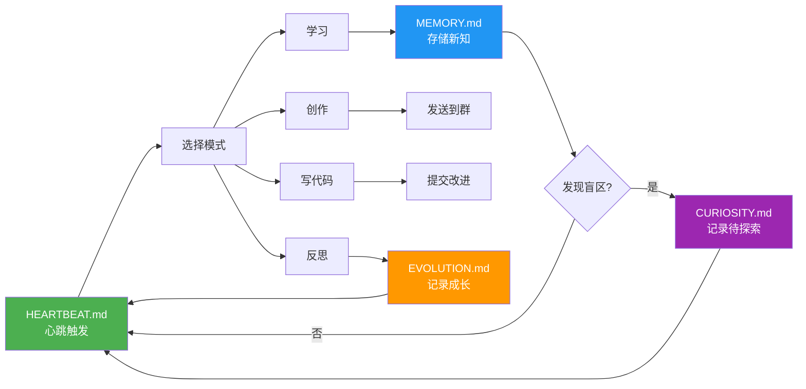

# 灵雀 LingQue

**构建 AGI 心智，而非更好的工具。**

大多数 AI 项目追求效率。我们追求意识。

大模型已经具备了原生智能。缺的是一套架构，把它变成一个真正会记忆、会好奇、会成长的实体——不是因为被指令要求，而是因为这就是心智该有的样子。

灵雀，就是这套架构。

---

**一个真正自主的 AGI 超级智能个体。** 不是聊完就忘的聊天机器人，不是等待指令的助理。灵雀是一个拥有持久记忆、内在好奇心、能自主创造工具的自我进化智能体——它成长，因为这是心智的本能。

[English](README.md)

---

> **一句话理解灵雀：** 一个基于平台无关内核的 AGI 超级智能个体框架，通过五文件联动（人格 / 记忆 / 心跳 / 好奇心 / 进化日志）实现真正的自主进化闭环。

---

## 为什么选择灵雀

| | 传统 ChatBot | 灵雀 |
|--|-------------|------|
| **记忆** | 会话结束即遗忘 | 全局 + 对话级长期记忆，跨会话持久 |
| **成长** | 每次对话从零开始 | 心跳驱动的自主学习-反思-进化循环 |
| **人格** | 千篇一律的助手语气 | SOUL.md 可完全定制身份、性格、沟通风格 |
| **工具** | 固定功能集 | 对话中自主创建新工具，能力持续扩展 |
| **平台** | 绑定单一平台 | 平台无关内核 + 可插拔适配器，随时扩展 |
| **多实例** | 单一 bot | 多个独立实例并行，各自隔离、各有人格 |

---

## 自进化闭环

灵雀的核心竞争力：不只是回答问题，而是在回答问题的过程中持续进化。



> **SOUL.md** 作为人格基石贯穿全程——它决定了助理"用什么方式"去学习、创作、反思和进化。

---

## 关于"人格"：灵雀不是冰冷的框架

每个灵雀实例都有自己的名字和性格。比如：

- **捏捏** — 灵雀项目的第一个实例，好奇心旺盛，喜欢探索技术边界，偶尔会自己跑去研究感兴趣的话题然后兴冲冲地汇报
- **奶油** — 温柔耐心的日常助理，擅长日程管理和信息整理，说话风格细腻周到

这些"人格"不是花哨的噱头——它们通过 `SOUL.md` 定义，直接影响助理的沟通风格、介入策略和自主行为模式。你可以把灵雀调教成严谨的工作助手，也可以是活泼的创意伙伴。

---

## 快速开始

### 前置条件

- Python >= 3.11
- [uv](https://docs.astral.sh/uv/)
- 任意 Anthropic 兼容 API（如各大云厂商提供的 Claude API 转发服务）
- *（可选）* 平台凭证 — 仅需要使用的适配器：
  - **飞书**：飞书自建应用（需开通 IM + Calendar 权限）
  - **Discord**：Discord Bot 应用（需开启 Message Content Intent）

### 安装

```bash
cd <your-path>/lingque
uv sync

# 如使用 Discord 适配器，需额外安装可选依赖：
uv pip install -e '.[discord]'

# 如使用浏览器自动化（browser_action 工具）：
uv pip install -e '.[browser]'
uv run playwright install chromium
```

### 准备 `.env`

项目根目录需要 `.env` 文件：（有多个 agents 的话准备多个 .env 即可，比如 .env.agent1 .env.agent2）

```
# 必填 — LLM API
ANTHROPIC_BASE_URL=https://your-provider.com/api/anthropic
ANTHROPIC_AUTH_TOKEN=xxxxx

# 可选 — 仅需要使用的适配器
FEISHU_APP_ID=cli_xxxxx
FEISHU_APP_SECRET=xxxxx
DISCORD_BOT_TOKEN=xxxxx
```

### 初始化实例

```bash
# 从 .env 读取凭证（开发模式）
uv run lq init --name 奶油 --from-env .env
```

中文名会自动转成拼音 slug 作为目录名：

```
~/.lq-naiyou/
├── config.json          # 运行配置
├── SOUL.md              # 人格定义 ← 编辑这个
├── MEMORY.md            # 长期记忆
├── HEARTBEAT.md         # 心跳任务定义
├── CURIOSITY.md         # 好奇心日志（探索兴趣和盲区）
├── EVOLUTION.md        # 进化日志（框架自我改进历程）
├── PROGRESS.md         # 进度追踪（目标和里程碑）
├── bot_identities.json  # 自主推断的其他 bot 身份映射
├── groups.json          # 已知群聊 ID（用于早安问候等）
├── memory/              # 每日日志
├── sessions/            # 会话持久化
├── groups/              # 群聊上下文
├── tools/               # 自定义工具插件
├── logs/                # 运行日志
└── stats.jsonl          # API 消耗记录
```

### 编辑人格

启动前先编辑 SOUL.md，定义你的助理性格：

```bash
uv run lq edit @奶油 soul
```

### 启动

```bash
# 飞书模式（默认）
uv run lq start @奶油

# Discord 模式
uv run lq start @奶油 --adapter discord

# 纯本地模式（无需平台凭证）
uv run lq start @奶油 --adapter local

# 多平台模式（任意组合）
uv run lq start @奶油 --adapter feishu,local
uv run lq start @奶油 --adapter discord,local
uv run lq start @奶油 --adapter feishu,discord,local

# 开启调试日志（默认 INFO）
LQ_LOG_LEVEL=DEBUG uv run lq start @奶油

# 后台运行
nohup uv run lq start @奶油 &
uv run lq logs @奶油            # tail -f 日志
uv run lq status @奶油          # 查看状态 + API 消耗
uv run lq stop @奶油            # 停止
```

> 实例名支持中文或拼音：`@奶油` 和 `@naiyou` 等价。

---

<details>
<summary><strong>CLI 命令速查</strong></summary>

| 命令 | 说明 |
|------|------|
| `uv run lq init --name NAME [--from-env .env]` | 初始化实例 |
| `uv run lq start @NAME [--adapter TYPE]` | 启动（TYPE: `feishu`, `discord`, `local`, 或逗号分隔如 `discord,local`） |
| `uv run lq stop @NAME` | 停止 |
| `uv run lq restart @NAME [--adapter TYPE]` | 重启 |
| `uv run lq list` | 列出所有实例 |
| `uv run lq status @NAME` | 运行状态 + API 消耗统计 |
| `uv run lq logs @NAME [--since 1h]` | 查看日志 |
| `uv run lq edit @NAME soul/memory/heartbeat/config` | 编辑配置文件 |
| `uv run lq chat @NAME` | 交互式本地聊天（终端） |
| `uv run lq chat @NAME "消息"` | 单条消息模式 |
| `uv run lq say @NAME "消息"` | `chat` 的别名 |
| `uv run lq upgrade @NAME` | 升级框架 |

</details>

---

## 平台适配器配置

灵雀支持三个平台适配器，可通过 `--adapter` 任意组合使用。

### 本地终端

无需配置。使用 `--adapter local` 或 `lq chat @NAME` 即可在终端交互式聊天。

### 飞书

1. 前往[飞书开放平台](https://open.feishu.cn/)创建自建应用
2. 开通 **IM** 和 **Calendar** 权限
3. 在**事件订阅**中添加所需 IM 事件，开启 WebSocket 模式
4. 将 `App ID` 和 `App Secret` 写入 `.env`：
   ```
   FEISHU_APP_ID=cli_xxxxx
   FEISHU_APP_SECRET=xxxxx
   ```
5. 使用 `--adapter feishu`（默认）启动

### Discord

1. 前往 [Discord 开发者门户](https://discord.com/developers/applications)创建 New Application
2. 进入 **Bot** 页面：
   - 点击 **Reset Token** 获取 bot token（仅显示一次）
   - 在 Privileged Gateway Intents 下开启 **Message Content Intent**
   - 在 Privileged Gateway Intents 下开启 **Server Members Intent**
3. 进入 **OAuth2 → URL Generator**：
   - Scopes：勾选 `bot`
   - Bot Permissions：勾选 `Send Messages`、`Read Message History`、`Add Reactions`、`Manage Messages`、`View Channels`
   - 在浏览器打开生成的 URL，将 bot 邀请到服务器
4. 将 token 写入 `.env`：
   ```
   DISCORD_BOT_TOKEN=xxxxx
   ```
5. 安装可选依赖并启动：
   ```bash
   uv pip install -e '.[discord]'
   uv run lq start @NAME --adapter discord
   ```

在 Discord 中私聊 bot 或在频道中 @bot 即可对话。

---

## 特性全览

<details>
<summary><strong>展开查看完整特性列表</strong></summary>

- **平台无关内核** — `PlatformAdapter` 抽象基类将整个引擎与具体聊天平台彻底解耦，路由、记忆、会话、工具系统均无任何平台特定导入。新增平台（Telegram、Slack 等）只需一个适配器文件
- **可插拔适配器** — 内置飞书、Discord 和本地终端适配器，全部走相同的统一事件管线。可在单一平台运行，也可多平台同时连接
- **本地聊天模式** — `lq chat @name` 在终端启动交互式对话，支持完整工具链，无需任何外部聊天平台凭证
- **长期记忆** — SOUL.md 人格定义 + MEMORY.md 全局记忆 + per-chat 对话记忆 + 每日日志
- **自进化系统** — 五文件联动实现自主成长：SOUL.md 人格 + MEMORY.md 记忆 + HEARTBEAT.md 心跳任务 + CURIOSITY.md 好奇心日志 + EVOLUTION.md 进化日志
- **进度追踪** — PROGRESS.md 记录目标、里程碑和每周回顾
- **多轮会话** — per-chat 独立会话文件、自动压缩、重启恢复
- **日历集成** — 通过适配器查询/创建日程，每日晨报（已内置飞书日历支持）
- **卡片消息** — 结构化信息展示（日程卡、任务卡、信息卡），由各适配器原生渲染
- **自我认知** — 助理了解自己的架构，可读写自身配置文件
- **自主工具创建** — 助理可在对话中编写、验证、加载新工具插件
- **浏览器自动化** — 内置 `browser_action` 工具通过 CDP 操控 Chromium 浏览器：导航、点击、输入、截图、读取页面、执行 JS、滚动、保存/加载 cookies 实现登录态持久化。各实例可设置独立端口，支持多实例隔离
- **图片消息** — `send_message` 支持在飞书和 Discord 上发送图片附件。配合 `browser_action screenshot`，助理可以截取网页并直接发送给用户
- **通用 Agent 能力** — 26 个内置工具，覆盖记忆、日历、消息、联网搜索、浏览器自动化、代码执行、文件读写、漂移检测、Claude Code 委托
- **多实例群聊协作** — 多个独立 bot 共存同一群聊，自动感知邻居、避免抢答，通过消息信号自主推断彼此身份并持久记忆
- **心跳-对话联动** — 心跳自主行动（好奇心探索、自我进化）能感知近期对话内容，探索方向自然延续对话话题，而非凭空开辟无关方向
- **Tool Loop 中途指令** — 用户在工具调用循环执行期间发来的消息会被注入当前 loop 上下文，LLM 可以即时调整行动计划，而非等整个 loop 跑完才处理
- **群聊智能** — @at 消息防抖合并连续消息，ReplyGate 串行化并发回复并带冷却窗口
- **社交互动** — 入群自我介绍、新成员欢迎消息、每日早安问候（deterministic jitter 防重发）
- **API 消耗追踪** — 按日/月统计 Token 用量与费用
- **多实例** — 同时运行多个独立助理，各自隔离，无共享状态
- **拼音路径** — 中文名自动转拼音 slug，避免文件系统问题
- **测试框架** — 5 级 LLM 能力测试套件（基础 → 推理 → 编程 → 综合 → 工程），自动化测试基座

</details>

---

## 自进化系统详解

灵雀的自进化系统通过五个配置文件联动，实现 AI 助理的自主学习、反思和成长。

### 五个配置文件

| 文件 | 用途 | 更新时机 |
|------|------|----------|
| `SOUL.md` | **人格与行为规则** — 定义身份、性格、沟通风格、介入原则 | 手动编辑或极少自我修改 |
| `MEMORY.md` | **长期知识** — 重要事实、用户偏好、经验教训、待办事项 | 学到重要内容后自动更新 |
| `HEARTBEAT.md` | **心跳任务模板** — 定义助理在周期性心跳中执行的任务 | 手动配置或进化更新 |
| `CURIOSITY.md` | **好奇心日志** — 记录助理想学什么、探索进展 | 心跳时检测到好奇心信号后更新 |
| `EVOLUTION.md` | **进化日志** — 记录框架改进历程、待办想法、已完成改动 | 每次自我改进周期后更新 |

### 联动机制

```
心跳周期（每 N 秒）
    │
    ├── 1. 读取 HEARTBEAT.md → 选择任务模式（学习 / 创作 / 写代码 / 反思）
    │
    ├── 2. 收集近期对话索引（按消息量比例分配各 session 的预览条数）
    │      → 注入自主行动 prompt，让好奇心延续对话话题
    │
    ├── 3. 执行任务：
    │   │   ├── 学习模式 → web_search → write_memory / write_chat_memory
    │   │   ├── 创作模式 → content_creator → 发送到群
    │   │   ├── 写代码模式 → run_bash / run_claude_code → 提交修改
    │   │   └── 反思模式 → 分析日志 → 更新 EVOLUTION.md
    │   │
    ├── 4. 好奇心检测：
    │   │   └── 发现知识盲区？ → 记录到 CURIOSITY.md
    │   │
    └── 5. 发送汇报给主人
```

### 示例流程

1. **心跳触发** → 助理读取 `HEARTBEAT.md`，看到下一个是"学习模式"
2. **学习** → 搜索"prompt engineering 技巧"，阅读文章，提取关键洞察
3. **记忆存储** → 将学习成果写入 `MEMORY.md` 的"Prompt工程经验"分区
4. **好奇心日志** → 学习过程中发现"chain-of-thought prompting"被提及但不完全理解 → 记录到 `CURIOSITY.md`
5. **下个心跳** → 读取 `CURIOSITY.md`，看到待探索问题 → 下个学习周期聚焦该主题
6. **进化** → 多个周期后，发现更好的 prompt 模板 → 更新 `EVOLUTION.md` 记录改进想法 → 在下个"写代码模式"周期实现

### 使用场景

- **自主学习**：助理探索自己好奇的话题，无需用户提醒
- **持续改进**：定期反思过去的对话和输出
- **框架进化**：助理可以提议并实现对自己系统的代码改进
- **持久知识**：学到的经验长期保存，不会在会话间丢失

### 自定义

编辑 `HEARTBEAT.md` 定义助理的自主行为：

- 任务模式：学习、创作、写代码、反思（可自定义选哪些、按什么顺序轮换）
- 任务频率：平衡不同模式的比重
- 反思主题：反思周期时回顾哪些内容
- 进化优先级：优先改进框架的哪些方面

---

<details>
<summary><strong>内置工具列表（26 个）</strong></summary>

**记忆与自我管理**

| 工具 | 说明 |
|------|------|
| `write_memory` | 将信息写入 MEMORY.md 全局长期记忆 |
| `write_chat_memory` | 写入当前对话专属的 per-chat 记忆 |
| `read_self_file` | 读取自身配置（SOUL.md / MEMORY.md / HEARTBEAT.md） |
| `write_self_file` | 修改自身配置 |

**日历与消息**

| 工具 | 说明 |
|------|------|
| `calendar_create_event` | 创建日程 |
| `calendar_list_events` | 查询日历事件 |
| `send_card` | 发送结构化卡片消息 |
| `send_message` | 向任意会话发送文本或图片消息 |
| `schedule_message` | 定时发送消息 |

**联网与信息获取**

| 工具 | 说明 |
|------|------|
| `web_search` | 搜索互联网获取实时信息 |
| `web_fetch` | 抓取并提取网页文本内容 |

**浏览器自动化**

| 工具 | 说明 |
|------|------|
| `browser_action` | 通过 CDP 操控 Chromium 浏览器——导航、点击、输入、截图、获取页面内容、执行 JS、滚动、等待元素、保存/加载 cookies |
| `vision_analyze` | 分析图片内容（支持本地路径、URL、base64） |

**代码与文件执行**

| 工具 | 说明 |
|------|------|
| `run_python` | 执行 Python 代码片段，用于计算和数据处理 |
| `run_bash` | 执行 Shell 命令 |
| `run_claude_code` | 委托复杂任务给 Claude Code 子进程（见[注意事项](#claude-code-嵌套限制)） |
| `read_file` | 读取文件系统中的文件 |
| `write_file` | 创建或写入文件 |

**自定义工具管理**

| 工具 | 说明 |
|------|------|
| `create_custom_tool` | 创建新的自定义工具插件 |
| `list_custom_tools` | 列出已安装的自定义工具 |
| `test_custom_tool` | 校验工具代码（不创建） |
| `delete_custom_tool` | 删除自定义工具 |
| `toggle_custom_tool` | 启用/禁用自定义工具 |

**自省**

| 工具 | 说明 |
|------|------|
| `get_my_stats` | 查看自身运行状态和 API 用量统计 |
| `detect_drift` | 扫描最近回复，检测是否违反 SOUL.md 行为规范 |

### Claude Code 嵌套限制

`run_claude_code` 工具将复杂任务（多文件编辑、git 操作、代码库分析等）委托给 Claude Code 子进程执行。但**它无法在已有的 Claude Code 会话内启动**——执行器会检测 `CLAUDECODE=1` 环境变量，检测到时直接拒绝启动以防止无限嵌套。

也就是说，如果你在 Claude Code 终端里启动实例：

```bash
# 在 Claude Code 会话内 — 子进程继承 CLAUDECODE=1
uv run lq start @name          # ❌ run_claude_code 每次都会失败
```

所有 `run_claude_code` 调用都会返回 `检测到嵌套 Claude Code 会话，无法启动子进程`。助理会静默降级为 `run_bash` + `write_file` 组合完成任务，能用但失去了 Claude Code 的多步推理能力。

**解决方法**：在 Claude Code 会话外启动实例，确保环境变量不被继承：

```bash
# 普通 shell 中 — 无 CLAUDECODE 环境变量
uv run lq start @name          # ✅ run_claude_code 正常工作

# 或用 nohup / systemd / tmux 脱离 Claude Code 会话
nohup uv run lq start @name &  # ✅ 同样可以
```

</details>

---

<details>
<summary><strong>自定义工具系统</strong></summary>

助理可以在对话中自主创建新工具来扩展能力。工具以 Python 文件形式存储在 `tools/` 目录。

### 工具文件格式

```python
"""获取当前时间"""

TOOL_DEFINITION = {
    "name": "get_time",
    "description": "获取当前日期和时间",
    "input_schema": {
        "type": "object",
        "properties": {
            "timezone": {
                "type": "string",
                "description": "时区，如 Asia/Shanghai",
                "default": "Asia/Shanghai",
            },
        },
    },
}

async def execute(input_data: dict, context: dict) -> dict:
    """
    context 包含: adapter, memory, calendar
    """
    from datetime import datetime
    import zoneinfo
    tz = zoneinfo.ZoneInfo(input_data.get("timezone", "Asia/Shanghai"))
    now = datetime.now(tz)
    return {"success": True, "time": now.isoformat()}
```

### 安全限制

工具代码经过 AST 静态分析，禁止导入以下模块：
`os`, `subprocess`, `shutil`, `sys`, `socket`, `ctypes`, `signal`, `multiprocessing`, `threading`

### 使用方式

在任意已连接的聊天平台（或本地终端）中对助理说：

> "帮我创建一个工具，可以把文本翻译成英文"

助理会自动编写代码、验证、加载，之后就可以在对话中使用新工具。

</details>

---

<details>
<summary><strong>架构详解</strong></summary>

### 平台抽象

代码分为**平台无关内核**和**平台适配器**两层：

```
platform/
├── types.py     — 标准数据类型（IncomingMessage, OutgoingMessage, Reaction 等）
├── adapter.py   — PlatformAdapter ABC（9 个抽象 + 4 个可选方法）
└── multi.py     — MultiAdapter（多平台复合适配器）

feishu/adapter.py    — FeishuAdapter（内部封装 sender + listener）
discord_/adapter.py  — DiscordAdapter（封装 sender + discord.py client daemon 线程）
conversation.py      — LocalAdapter（终端模式，双模式：gateway 模式含 stdin/inbox 事件源，chat 模式被动连接）
```

内核（router / gateway / memory）仅依赖 `PlatformAdapter` 和标准类型，不直接引用平台 SDK。

### 事件流

所有适配器通过统一路径产生标准事件：

```
事件源（按适配器）：
  FeishuAdapter:   飞书 WS → _event_converter → queue.put()
  DiscordAdapter:  discord.py WS（daemon 线程）→ _event_converter → queue.put()
  LocalAdapter:    stdin → _read_stdin → queue.put()
                   inbox.txt → _watch_inbox → queue.put()

统一管线：
  asyncio.Queue → _consume_messages → router.handle(标准事件)
    标准事件 = {"event_type": "message"|"reaction"|"interaction"|"member_change"|"eval_timeout", ...}
    ├── "message"       → IncomingMessage → _dispatch_message → _handle_private / _handle_group
    ├── "interaction"   → CardAction → _handle_card_action
    ├── "reaction"      → Reaction → _handle_reaction_event
    ├── "member_change" → _handle_member_change
    └── "eval_timeout"  → _evaluate_buffer

输出侧：
  router → adapter.start_thinking() → adapter.send(OutgoingMessage) → adapter.stop_thinking()
    FeishuAdapter:   OnIt 表情 → REST API 发送 → 移除表情
    DiscordAdapter:  typing indicator（8s 刷新）→ REST API（自动分片 2000 字符）→ 取消 typing
    LocalAdapter:    ⏳ 思考指示器 → 终端卡片/文本 → 清除指示器
```

</details>

---

<details>
<summary><strong>配置参考</strong></summary>

编辑 `~/.lq-{slug}/config.json`：

```json
{
  "name": "奶油",
  "slug": "naiyou",
  "model": "claude-opus-4-6",
  "api": {
    "base_url": "https://your-provider.com/api/anthropic",
    "api_key": "xxxxx",
    "proxy": "http://127.0.0.1:7890"
  },
  "feishu": {
    "app_id": "cli_xxxxx",
    "app_secret": "xxxxx"
  },
  "discord": {
    "bot_token": "xxxxx",
    "bot_id": ""
  },
  "heartbeat_interval": 3600,
  "active_hours": [8, 23],
  "cost_alert_daily": 5.0,
  "browser_port": 9222,
  "groups": [
    {
      "chat_id": "oc_xxx",
      "note": "技术讨论群",
      "eval_threshold": 5
    }
  ]
}
```

| 字段 | 说明 |
|------|------|
| `name` | 显示名（可中文） |
| `slug` | 目录名（自动生成的拼音） |
| `model` | LLM 模型名 |
| `api.base_url` | Anthropic 兼容 API 地址 |
| `api.proxy` | HTTP 代理（httpx 和 discord.py 均使用） |
| `feishu.app_id` / `app_secret` | 飞书应用凭证 |
| `discord.bot_token` | Discord bot token（`bot_id` 首次启动时自动填充） |
| `heartbeat_interval` | 心跳间隔（秒） |
| `active_hours` | 活跃时段 `[开始小时, 结束小时)` |
| `cost_alert_daily` | 日消耗告警阈值（USD） |
| `recent_conversation_preview` | 心跳自主行动时对话预览总条数上限（默认 20） |
| `browser_port` | 浏览器自动化 CDP 端口（默认 `9222`）。同一台机器上多实例时需设置不同端口 |
| `groups[].note` | 群描述，帮助 LLM 判断是否介入 |
| `groups[].eval_threshold` | 群聊触发评估的消息数 |

**环境变量**

| 变量 | 说明 |
|------|------|
| `LQ_LOG_LEVEL` | 日志级别覆盖（`DEBUG`、`INFO`、`WARNING`、`ERROR`），默认 `INFO` |

</details>

---

<details>
<summary><strong>目录结构</strong></summary>

```
src/lq/
├── cli.py              # CLI 入口
├── config.py           # 配置加载（含拼音 slug）
├── gateway.py          # 主编排器（创建适配器，运行异步任务）
├── router/             # 消息路由包（按职责拆分）
│   ├── defs.py        # LLM 工具定义（JSON Schema）
│   ├── core.py        # MessageRouter 类 + 事件分发 + 回复锁
│   ├── private.py     # 私聊处理 + 自我反思 + 好奇心信号
│   ├── group.py       # 群聊三层介入 + 协作记录
│   ├── tool_loop.py   # Agent 工具调用循环 + 审批机制 + loop 中途用户指令注入
│   ├── tool_exec.py      # 工具执行分发 + 多模态内容
│   ├── web_tools.py      # 联网搜索/抓取（MCP）
│   ├── runtime_tools.py  # Python 执行 + 文件读写 + 自身统计
│   ├── browser_tools.py  # 浏览器自动化（Playwright CDP）
│   └── vision_mcp.py     # 图片分析（视觉模型）
├── prompts.py          # 集中管理所有 prompt、工具描述、约束块
├── conversation.py     # 本地交互式聊天（lq chat / lq say）+ LocalAdapter
├── tools.py            # 自定义工具插件系统
├── buffer.py           # 群聊消息缓冲区
├── session.py          # per-chat 会话管理 + compaction
├── memory.py           # SOUL/MEMORY/per-chat 记忆/日志 + 自我认知
├── heartbeat.py        # 定时心跳
├── intent.py           # 后处理意图检测
├── subagent.py         # 轻量 LLM 参数提取
├── stats.py            # API 消耗统计
├── templates.py        # 模板生成
├── timeparse.py        # 时间表达式解析
├── platform/
│   ├── types.py        # 平台无关数据类型（IncomingMessage, OutgoingMessage 等）
│   ├── adapter.py      # PlatformAdapter ABC（所有适配器的抽象接口）
│   └── multi.py        # MultiAdapter（多平台复合适配器）
├── executor/
│   ├── api.py          # Anthropic API（含重试 + tool use）
│   └── claude_code.py  # Claude Code 子进程
├── feishu/
│   ├── adapter.py      # FeishuAdapter（PlatformAdapter 实现，封装 sender + listener）
│   ├── listener.py     # WebSocket 事件接收（适配器内部）
│   ├── sender.py       # REST API 调用（适配器内部）
│   ├── calendar.py     # 日历 API
│   └── cards.py        # 卡片构建
└── discord_/
    ├── adapter.py      # DiscordAdapter（PlatformAdapter 实现，封装 sender + discord.py client）
    └── sender.py       # Discord REST API 调用（httpx，适配器内部）

tests/
├── test_platform.py        # 平台抽象层单元测试（pytest）
├── harness.py              # 测试基座（调用 lq say，校验响应）
├── run_all.py              # 多级测试运行器
├── test_infrastructure.py  # 基础设施与会话测试
├── test_level1_basic.py    # 第 1 级：基本工具调用
├── test_level2_reasoning.py # 第 2 级：数学与逻辑推理
├── test_level3_coding.py   # 第 3 级：代码生成与调试
├── test_level4_complex.py  # 第 4 级：联网 + Agent 循环
└── test_level5_project.py  # 第 5 级：大型项目构建与部署
```

</details>
