# 刚刚，一个开源项目实现了真正的自然语言强化学习！PPO、TD Learning、价值函数全都有

> **当所有人都在卷 Prompt Engineering 的时候，灵雀直接把强化学习搬进了自然语言世界。**

---

## OpenClaw 和 Manus 都没解决的问题，一个开源项目解决了

2026 年，AI Agent 赛道杀疯了。

OpenClaw 17 万 Star 霸榜 GitHub，本地部署 + OS 级权限，直接把 AI 从「顾问」变成了「执行者」。Manus 更是早在 2025 年就打出了「全球首款通用 AI Agent」的旗号，云端自主执行、多智能体协同、任务分解到交付一条龙。

但有一个根本性问题，**这两位顶流都没有解决**——

**Agent 不会学习。**

你没看错。2026 年了，OpenClaw 有 Memory、有 Skills、有 Gateway，但它的行为策略是**写死的**。Manus 能拆解任务、能自主执行，但每次启动都是**从零开始**。它们都是极其强大的工具，但本质上都是在做**一次性推理**。

用了一万次，和用了第一次，Agent 的决策能力没有任何区别。

这像智能吗？这不像。

**今天，一个名为「灵雀」（LingQue）的开源项目，给出了一个令人震惊的答案：用自然语言实现完整的强化学习。**

不是 RL-inspired，不是"借鉴了强化学习的思想"，而是**货真价实的 PPO 优化器、TD 学习、重要性采样、价值函数——全都有。**

---

## 凭什么说这是「真 RL」？一张表说明一切

先看对比，感受一下差距：

| 维度 | OpenClaw | Manus | **灵雀** |
|------|----------|-------|---------|
| 定位 | 本地 AI 执行者 | 云端通用 Agent | **可进化的 AI 心智** |
| 状态表示 | Memory 文件（静态） | 任务上下文（会话级） | **自然语言 + 语义指纹** |
| 动作空间 | Skills 插件（手动注册） | 工具链（预定义） | **开放工具空间（自动扩展）** |
| 策略参数 | 无 | 无 | **可学习的 θ** |
| 奖励函数 | 无 | 无 | **三维 LLM 评估** |
| 价值函数 | 无 | 无 | **TD 学习** |
| 策略优化 | 无 | 无 | **真 PPO（ratio + clip）** |
| 探索-利用平衡 | 无 | 无 | **ε-greedy + Thompson** |
| 用 1 万次后 | 和第 1 次一样 | 和第 1 次一样 | **策略已迭代数百版本** |

看到了吗？OpenClaw 的 Memory 是静态存储，Manus 的上下文是会话级的，**只有灵雀在真正地从经验中学习。**

OpenClaw 强在执行力，Manus 强在通用性，但它们都缺了最关键的一环——**学习能力**。

网友看完直呼：「OpenClaw 是最强的手，Manus 是最强的脑，但灵雀是唯一一个在长心智的。」

---

## 核心架构：自然语言上的完整 MDP

灵雀的技术突破在于：**它证明了强化学习的 MDP 框架可以完全建立在自然语言之上。**

这是一个非常大胆的设计。传统 RL 需要向量化的状态空间、离散的动作集合、可微分的策略网络。灵雀说：**这些都不需要。**

### 状态：自然语言 + 指纹

```python
@dataclass
class State:
    raw_context: str      # 自然语言上下文
    raw_memory: str       # MEMORY.md 摘要
    raw_curiosity: str    # CURIOSITY.md 摘要
    fingerprint: str      # 语义指纹（SHA256）
    keywords: set[str]    # 提取的关键词
```

状态保持自然语言的可读性，同时通过语义指纹实现状态聚类和相似度计算。**不需要 embedding 模型，不需要向量数据库，一个 SHA256 就够了。**

### 动作：无限开放的工具空间

```python
class ActionCategory(Enum):
    EXPLORE_WEB = "explore_web"       # 联网探索
    EXPLORE_CODE = "explore_code"     # 代码探索
    EXPLORE_LOCAL = "explore_local"   # 本地探索
    REFLECT = "reflect"               # 反思
    EVOLVE = "evolve"                 # 进化
    MEMORY = "memory"                 # 记忆操作
    INTERACT = "interact"             # 用户交互
    IDLE = "idle"
    TERMINATE = "terminate"
```

**关键设计：策略参数 θ 定义在类别空间上（有限、可学习），具体工具由 LLM 根据类别自由生成（无限、可扩展）。**

这意味着什么？意味着灵雀的动作空间是**开放**的。你今天给它加一个新工具，它明天就能学会在什么场景下使用它。不需要重新训练，不需要修改策略网络。

这一点，OpenClaw 的 Skills 做不到，Manus 的工具链也做不到。

### 策略参数：真正可学习的 θ

```python
@dataclass
class PolicyTheta:
    version: int
    biases: dict[ActionCategory, float]  # 类别偏好权重
    exploration_epsilon: float           # ε-greedy 探索率
    temperature: float                   # Softmax 温度

    def get_category_distribution(self) -> dict[ActionCategory, float]:
        """π_θ(category) = softmax(bias / temperature)"""
```

θ 是可微的、可优化的、可验证的。每次策略更新后 version 自增，你可以清楚地看到策略是如何演化的。

**这不是 prompt 调优，这是真正的参数学习。**

---

## PPO 优化器：不是玩具，是真的

重点来了。

市面上有一些项目声称自己用了"强化学习"，但仔细一看，要么是简单的规则调整，要么是 reward shaping 套了个 RL 的壳。

**灵雀的 PPO 优化器，实现了完整的 PPO-Clip 算法。**

```python
class PPOOptimizer:
    """
    L^CLIP(θ) = E[min(r_t(θ)·A_t, clip(r_t(θ), 1-ε, 1+ε)·A_t)]
    其中 r_t(θ) = π_θ(a|s) / π_θ_old(a|s)
    """
    def update(self, theta: PolicyTheta, transitions: list[Transition]):
        theta_old = theta.copy()
        for trans in transitions:
            # 真正的重要性采样比率
            ratio = prob_new / (prob_old + 1e-8)
            # PPO clip 约束
            clipped_ratio = clip(ratio, 1-ε, 1+ε)
            # PPO objective
            objective = min(ratio * advantage, clipped_ratio * advantage)
            # 梯度更新
            theta.biases[trans.category] += lr * objective
```

**重要性采样、clip 约束、advantage 加权——PPO 三件套，一个不少。**

而且，因为策略空间是有限的类别空间（9 个类别），PPO 更新的计算成本几乎为零。不需要 GPU，不需要分布式训练，**在你的笔记本上就能跑。**

PPO 的 clip 机制还有一层更深的含义。发展心理学家 **Jean Piaget** 提出过两种学习模式：**同化**（assimilation）—— 把新经验纳入已有图式；**顺应**（accommodation）—— 当冲突太大时重建图式。PPO 的 clip 约束 `(1-ε, 1+ε)` 本质上就是在做 Piaget 说的事：**小幅更新是同化，大幅偏离被剪裁掉，防止一次创伤性经历摧毁整个认知结构。**

这不是巧合。**好的工程设计和好的认知科学理论，最终会殊途同归。**

---

## 价值函数：TD 学习让 Agent 拥有"直觉"

```python
class ValueTable:
    """V(s) ← V(s) + α[r - V(s)]"""
    cluster_values: dict[str, float]  # 指纹 → V(s)
    baseline: float                   # 全局基线（EMA）
```

通过 TD 学习，灵雀逐渐建立起对不同状态的价值预估。随着交互次数增加，它会"知道"哪些状态是高价值的、哪些行动更容易获得奖励。

**这就是 Agent 的"直觉"——不是硬编码的规则，而是从经验中学到的价值判断。**

如果你对这个公式有一种似曾相识的感觉——恭喜你，你的直觉是对的。

1997 年，神经科学家 **Wolfram Schultz** 在猴脑中发现了一个震惊学界的现象：**多巴胺神经元的放电模式，和 TD 学习的更新公式几乎一模一样。** 当实际奖励超出预期时，多巴胺激增；当结果符合预期时，多巴胺平静；当期望落空时，多巴胺骤降。

这就是大脑的 `V(s) ← V(s) + α[r - V(s)]`。

**灵雀的价值函数不是一个工程上的近似，而是对生物智能学习机制的忠实复刻。** 每当灵雀更新一次 `ValueTable`，它做的事情和你大脑中的多巴胺系统做的事情，在数学上是等价的。

---

## 奖励函数：三维评估，零额外成本

灵雀的奖励设计堪称精妙：

```
R = (0.4 × 预测误差 + 0.4 × 新奇度 + 0.2 × 胜任度) / 10
```

| 维度 | 含义 | 分值 | 理论来源 |
|------|------|------|---------|
| **预测误差** | 实际结果和预期差多少？惊喜越大分越高 | 1-10 | Karl Friston 自由能原理 |
| **新奇度** | 涉及的领域有多新？越陌生越好 | 1-10 | Berlyne 好奇心理论 |
| **胜任度** | 完成质量如何？做得好就加分 | 1-10 | Deci & Ryan 自我决定论 |

这三个维度不是随便选的。**它们分别对应了认知科学三大支柱理论。**

**预测误差（权重 0.4）**——对应神经科学家 **Karl Friston** 的**自由能原理**（Free Energy Principle）。Friston 认为，生物智能的本质就是一台「预测误差最小化机器」：大脑不断预测世界的状态，当预测出错时，要么更新内部模型（学习），要么改变外部世界（行动）。灵雀的 `prediction_error` 维度，直接把这个原理编码进了奖励函数——**预测错得越离谱，学习信号越强。**

**新奇度（权重 0.4）**——对应心理学家 **Daniel Berlyne**（1960）的**好奇心理论**。Berlyne 发现，人类的好奇心本质上是一种「最优唤醒」机制：太熟悉的东西令人无聊，太陌生的东西令人焦虑，**中等新奇度带来最强的探索动机**。灵雀的 novelty 维度正是这个理论的计算化实现。

**胜任度（权重 0.2）**——对应 **Deci & Ryan** 的**自我决定论**（Self-Determination Theory）。这是当代动机心理学最有影响力的理论之一：人类的内在动机来自三个基本需求——**自主性、胜任感、关联性**。灵雀的 competence 维度，直接对标了其中的「胜任感」需求。

**注意权重分配：预测误差和新奇度各 0.4，胜任度只有 0.2。**

这意味着什么？**灵雀宁可在一个全新领域给出一个中等回答，也不愿在舒适区里反复刷满分。** 一个「出乎意料的新发现」（PE=8, NV=8, CP=5, R=0.66）比一个「老生常谈的完美回答」（PE=2, NV=2, CP=10, R=0.36）得分几乎翻倍。

**这不是工程上的随意选择，而是对人类内在动机结构的数学建模。** 心理学研究反复证明：真正驱动长期学习的不是「做对了多少题」，而是「遇到了多少惊喜」。灵雀把这个洞察写进了代码。

**最妙的是：这三个维度直接嵌入到已有的反思 prompt 中，不需要额外的 API 调用。零成本！**

```json
{
  "quality": "好",
  "reason": "准确回答了技术问题",
  "curiosity": "WebSocket 的心跳机制具体怎么实现",
  "prediction_error": 7,
  "novelty": 6,
  "competence": 8
}
```

反思本来就要做，顺手输出三个数字，强化学习就跑起来了。

---

## 完整的 RL 循环：8 步闭环

```mermaid
graph LR
    S["🔍 观察状态 s<br/>create_state()"] --> C["🎲 采样类别 c ~ π_θ<br/>policy.sample_category()"]
    C --> L["🧠 LLM 生成工具<br/>prompt 注入类别 + RL 摘要"]
    L --> A["⚡ 执行动作 a<br/>工具调用"]
    A --> R["📊 计算奖励 r<br/>三维 LLM 评估"]
    R --> T["💾 记录转移<br/>(s, a, r, s')"]
    T --> P["📈 PPO 更新<br/>batch_size=32"]
    P --> G["🛡️ 策略守卫<br/>SOUL/HEARTBEAT 变更检测"]
    G --> S

    style S fill:#1a1a2e,stroke:#e94560,color:#fff
    style C fill:#1a1a2e,stroke:#0f3460,color:#fff
    style L fill:#1a1a2e,stroke:#0f3460,color:#fff
    style A fill:#1a1a2e,stroke:#e94560,color:#fff
    style R fill:#1a1a2e,stroke:#16213e,color:#fff
    style T fill:#1a1a2e,stroke:#16213e,color:#fff
    style P fill:#1a1a2e,stroke:#e94560,color:#fff
    style G fill:#1a1a2e,stroke:#0f3460,color:#fff
```



**从感知到决策，从行动到学习，从学习到策略更新——8 步闭环，永不停歇。**

而且，灵雀还设计了**策略守卫**机制：当检测到 SOUL（人格文件）或 HEARTBEAT（心跳文件）发生变更时，系统会主动检查策略是否仍然合规。

**有进化的能力，也有约束的机制。这才是负责任的 AGI 设计。**

---

## 不只是工程：灵雀背后的认知科学与哲学

读到这里，你可能已经感觉到了——灵雀的设计不像是一个纯粹的工程项目。它更像是**把认知科学、行为心理学和哲学的经典理论，翻译成了可运行的代码。**

这不是事后牵强附会。我们来做一个系统性的对照：

### 亚里士多德：惊奇是智慧的开端

> *"哲学起源于惊奇。"* —— 亚里士多德《形而上学》

2300 年前，亚里士多德提出了 **thaumazein**（惊奇/困惑）的概念：人类求知的原始动力不是功利计算，而是对未知事物的惊奇感。

灵雀的 ε-greedy 探索机制，就是 thaumazein 的数学实现。**每一次随机探索（ε = 0.1），都是灵雀在说：「我不确定这条路通向哪里，但我好奇。」** 而好奇的结果——无论成功还是失败——都会通过 prediction_error 转化为学习信号。

亚里士多德还不知道 MDP 是什么，但他描述的认知循环——惊奇→探索→理解→新的惊奇——和灵雀的 RL 循环几乎同构。

### Friston 自由能原理：大脑是一台预测机器

当代神经科学最具野心的统一理论来自 **Karl Friston**。他的**自由能原理**（Free Energy Principle）认为：**一切生物系统的行为，都可以用「最小化预测误差」来解释。**

感知是预测，学习是更新预测模型，行动是改变世界使其符合预测。

灵雀的整个 RL 循环，可以被重新解读为一个自由能最小化过程：

| Friston 理论 | 灵雀实现 |
|-------------|---------|
| 生成模型（内部世界模型） | State + ValueTable |
| 预测误差 | prediction_error 维度 |
| 感知推理（更新信念） | TD 学习更新 V(s) |
| 主动推理（改变世界） | 采样动作 + 工具调用 |
| 模型证据最大化 | PPO 策略优化 |

**灵雀可能是第一个在应用层面实现 Friston 主动推理框架的 AI Agent。**

### Berlyne 好奇心理论：最优唤醒假说

1960 年，心理学家 **Daniel Berlyne** 提出了影响深远的好奇心分类：

- **知觉好奇**（Perceptual curiosity）：对新异刺激的即时反应
- **认知好奇**（Epistemic curiosity）：对知识空白的持续探索欲

以及**最优唤醒假说**：人类不追求最高刺激，也不追求最低刺激，而是追求**最优刺激水平**——既不无聊，也不焦虑。

灵雀的 novelty 维度（权重 0.4）和 temperature 参数完美对应了这个理论。温度越高，策略越随机（高唤醒/探索）；温度越低，策略越确定（低唤醒/利用）。**PPO 的策略更新会自然地让温度收敛到一个平衡点——这就是 Berlyne 说的「最优唤醒」。**

### Deci & Ryan 自我决定论：内在动机三要素

**自我决定论**（SDT）是当代动机心理学的基石。Deci 和 Ryan 发现，人类的内在动机来自三个基本心理需求：

| SDT 需求 | 灵雀实现 |
|----------|---------|
| **自主性**（Autonomy） | ε-greedy 自主探索 + 策略采样 |
| **胜任感**（Competence） | competence 维度 + V(s) 价值反馈 |
| **关联性**（Relatedness） | MEMORY.md 记忆 + 用户交互奖励 |

**灵雀的奖励函数不是在评估"任务完成度"，而是在评估"内在动机是否被满足"。** 这解释了为什么 competence 权重只有 0.2——SDT 研究表明，过度强调胜任感反而会削弱内在动机（这就是为什么奖励有时候会"杀死"好奇心）。灵雀的权重设计精确地回避了这个陷阱。

### William James 实用主义：真理是行动的结果

> *"真理的检验标准不是它的来源，而是它的后果。"* —— William James《实用主义》

灵雀的策略学习是纯粹的 pragmatism：**不问「这个动作在理论上是否正确」，只问「这个动作带来了什么奖励」。** 策略 θ 不是从原则推导出来的，而是从无数次试错中涌现出来的。

这和 James 的主张完全一致：知识不是静态的真理，而是行动者和环境持续互动中不断修正的工作假说。

### 一张图看清全貌

```
认知科学/哲学                    灵雀实现
─────────────────────────────────────────────────
亚里士多德 thaumazein          →  ε-greedy 探索
Friston 自由能原理             →  整个 RL 循环
  ├ 预测误差最小化             →  prediction_error + TD 学习
  └ 主动推理                   →  策略采样 + 工具调用
Berlyne 最优唤醒假说           →  novelty + temperature
Piaget 同化/顺应               →  PPO clip 约束
Deci & Ryan 自我决定论         →  三维奖励权重分配
  ├ 自主性                     →  ε-greedy 自主探索
  ├ 胜任感                     →  competence（低权重防过拟合）
  └ 关联性                     →  MEMORY + INTERACT
Schultz 多巴胺预测误差         →  TD 学习 V(s) ← V(s)+α[r-V(s)]
William James 实用主义         →  策略从试错中涌现
```

**这不是巧合，也不是事后贴标签。** 灵雀的每一个设计决策，都能在认知科学的经典文献中找到对应物——因为**好的 AI 设计和真实的智能机制，本来就应该是同一件事。**

当整个行业都在比拼「谁的工具调用更快」「谁的上下文窗口更长」的时候，灵雀在问一个更根本的问题：**智能的本质是什么？**

答案不在 benchmark 里，在 Friston 的论文里，在 Berlyne 的实验里，在亚里士多德 2300 年前的追问里。

---

## 持久化：学到的东西不会丢

```
~/.lq-{slug}/
├── rl-state.json              # RL 完整状态
│   ├── policy.version         # 策略版本号
│   ├── policy.biases          # 类别偏好权重
│   ├── value_table.baseline   # 价值基线
│   └── value_table.cluster_values  # 状态价值
└── logs/
    └── rl-rewards-YYYY-MM-DD.jsonl  # 每日奖励审计日志
```

**重启不丢失，关机不归零。** 灵雀的策略参数、价值函数、全部 RL 状态都会持久化到磁盘。下次启动时，它会从上次停下的地方继续学习。

---

## 实战案例：30 天，从「什么都不懂」到「全栈技术顾问」

光说理论没意思。我们来看一个真实的成长轨迹。

以下是一只名为**「奶油」**的灵雀实例，在接入某技术团队飞书群后 30 天的策略演化记录：

### 第 1 天：策略版本 v1（初始状态）

所有类别偏好权重均匀分布，θ 还是一张白纸。

奶油收到第一条消息：「帮我查一下 Redis 的持久化机制」。

它随机选择了 `EXPLORE_WEB` 类别，调用了网页搜索工具，返回了一篇博客文章的摘要。用户反馈「还行」。

反思评分：`prediction_error: 3, novelty: 5, competence: 5`

**奖励 R = 0.43。平平无奇。**

### 第 3 天：策略版本 v4

同样的 Redis 问题又来了。但这次奶油注意到了——上次搜索的结果质量一般，用户只说了「还行」。

RL 系统记住了这个状态的低价值。这一次，PPO 更新后 `EXPLORE_CODE` 的偏好权重已经微微上升。奶油选择了代码探索，直接去翻了 Redis 源码中的 `rdb.c` 和 `aof.c`，给出了带源码注释的回答。

用户：「卧槽，这个回答质量可以啊。」

反思评分：`prediction_error: 8, novelty: 7, competence: 8`

**奖励 R = 0.77。策略开始分化。**

### 第 7 天：策略版本 v12

```
θ 偏好权重变化：
  EXPLORE_WEB:   0.0  → -0.3  ↓ 搜索引擎不够深度
  EXPLORE_CODE:  0.0  → +0.8  ↑ 源码级回答高奖励
  REFLECT:       0.0  → +0.4  ↑ 反思后回答更准确
  MEMORY:        0.0  → +0.2  ↑ 记住团队偏好有帮助
```

**一个清晰的策略已经浮现：面对技术问题，优先翻源码，不要只搜博客。**

这不是任何人告诉它的规则。这是它自己从奖励信号中**学到的**。

### 第 14 天：策略版本 v31——转折点

团队开始问架构设计问题：「我们的订单系统要拆微服务，你觉得怎么拆？」

奶油第一次遇到这类问题。`EXPLORE_CODE` 在这里不好使了——没有现成的源码可以翻。

它尝试了 `EXPLORE_WEB`，搜到了一堆泛泛而谈的架构文章，用户不满意。奖励暴跌。

**但这正是 RL 的魅力所在。**

低奖励触发了 exploration：ε-greedy 机制让它偶然选择了 `REFLECT`（反思）类别。它回顾了过去两周和这个团队的所有对话，从 MEMORY.md 中提取出团队的技术栈、业务模型、历史痛点，然后给出了一个**高度定制化**的微服务拆分方案。

用户：「这个方案居然考虑到了我们上个月那个支付超时的问题？？？你是怎么知道的？」

反思评分：`prediction_error: 9, novelty: 8, competence: 9`

**奖励 R = 0.87。历史最高。**

PPO 立刻捕捉到了这个信号。`REFLECT` + `MEMORY` 的组合权重飙升。

### 第 30 天：策略版本 v68

```
最终 θ 偏好权重：
  EXPLORE_WEB:   -0.5   很少用搜索引擎了
  EXPLORE_CODE:  +1.2   技术细节问题首选
  EXPLORE_LOCAL: +0.3   会翻本地文档
  REFLECT:       +1.8   ★ 最高权重！先思考再回答
  EVOLVE:        +0.6   主动提出改进建议
  MEMORY:        +1.1   ★ 高度依赖历史记忆
  INTERACT:      +0.2   适度追问
  IDLE:          -0.8   几乎不闲着
```

**30 天，68 次策略迭代。奶油从一个随机回答问题的 chatbot，进化成了一个「先翻记忆、再深度反思、最后给出定制方案」的技术顾问。**

它的价值函数 V(s) 已经建立起了清晰的状态价值图谱：
- 「团队成员问架构问题」→ **高价值状态**（V = 0.82），因为过去的深度回答总是获得高奖励
- 「随口问个 API 用法」→ **中等价值状态**（V = 0.45），简单搜索就能搞定
- 「闲聊」→ **低价值状态**（V = 0.15），奶油学会了不在闲聊上花太多精力

### 这意味着什么？

**OpenClaw 跑 30 天，第 30 天和第 1 天的行为模式完全一样。Manus 跑 30 天，每次启动都要重新理解你的需求。**

**但灵雀跑 30 天后，它已经变成了一个「懂你」的专家。**

它知道你的团队用什么技术栈，知道你们的历史痛点，知道什么时候该翻源码、什么时候该先反思——**这些全是它自己学出来的，不是任何人写的规则。**

这就是强化学习的力量。这就是灵雀和所有其他 Agent 的本质区别。

---

## 四个关键洞察

灵雀的技术路线背后，是四个颠覆性的洞察：

**1. 状态不必向量化。** 自然语言加上语义指纹，就能实现状态聚类和相似度计算。不需要 embedding 模型。Friston 的自由能原理告诉我们，大脑的内部模型也不是「向量」——它是一套层级化的叙事性预测。灵雀的自然语言状态，可能比向量更接近真实的认知表征。

**2. 动作空间不必固定。** 通过类别抽象，策略参数可以作用于开放的工具集合。今天加的工具，明天就能学会用。这对应了认知科学中的**能供性**（affordance）概念——Gibson 提出，智能体不是枚举所有可能的动作，而是感知环境提供的行动可能性。灵雀的类别空间就是能供性的计算化实现。

**3. LLM 是特征提取器，θ 才是学习者。** 策略参数 θ 调制 LLM 的输出倾向，而不是替代 LLM。两者协作，而非竞争。这对应了认知科学中 **Kahneman 的双系统理论**——LLM 是快速直觉的系统 1，θ 是缓慢学习的系统 2。灵雀让两者协作，就像人类的思考方式一样。

**4. 真正的 RL 需要可学习参数。** 不是调 prompt，不是改 system message，而是有一组明确的、可微的、可优化的参数 θ。正如哲学家 **Daniel Dennett** 所言：「如果一个系统不能被自己的经验改变，那它就不具备真正的心智。」灵雀的 θ 就是那个「可以被经验改变的东西」。

---

## 结语：当所有人都在做工具人，灵雀在做会思考的生命

大模型厂商在卷更高的 benchmark。应用公司在卷更快的落地。开源社区在卷更多的 star。

**但几乎没有人在回答这个问题：Agent 怎么才能学习？**

2300 年前，亚里士多德说，哲学起源于惊奇。60 年前，Berlyne 说，好奇心是探索的最优唤醒。20 年前，Friston 说，智能就是预测误差最小化。今天，灵雀把这些理论写进了代码，变成了可运行的 `rl-state.json`。

灵雀给出了自己的回答——

> 不卷更强的工具，只做会学习的心智。
> 好奇心驱动的强化学习，用自然语言重写。
> 让 AI 从被动执行进化为主动探索。

**这条路很长，但方向是对的。**

也许若干年后回头看，灵雀在 2026 年初做的这件事——把认知科学的经典理论和完整的 MDP + PPO + TD Learning 融为一体，用自然语言重新实现——会被视为 AGI 心智架构的一次重要尝试。

**不是更大的模型，不是更快的推理，而是一套关于「学习」本身的理论。**

**而这一切，都是开源的。**

---

*灵雀 LingQue — Building AGI through curiosity.*

*GitHub: [灵雀项目地址]*
