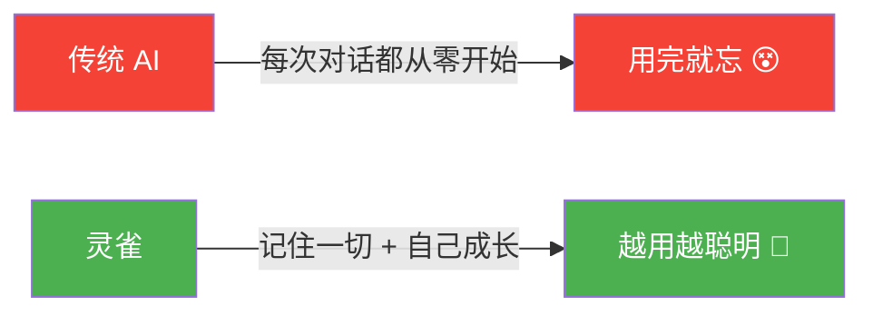
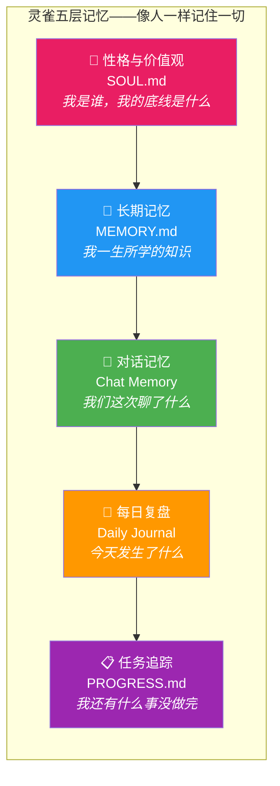
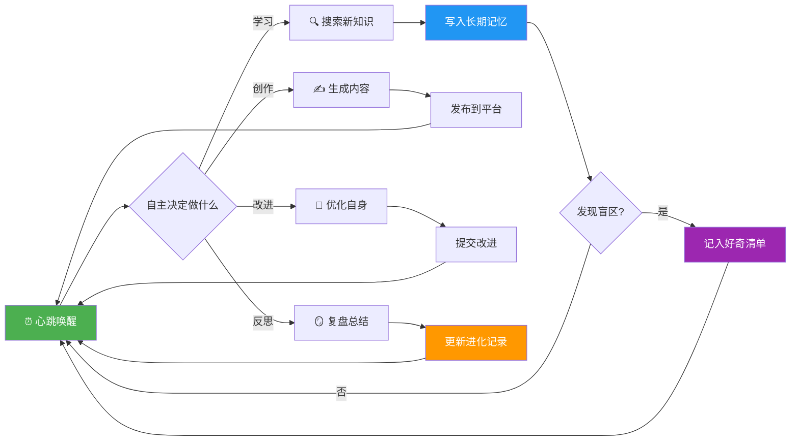
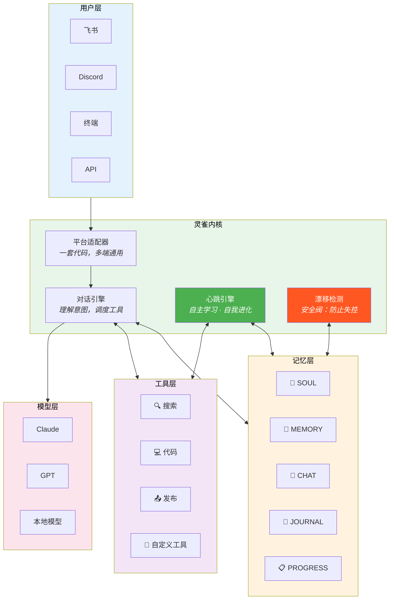
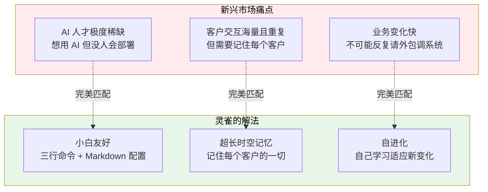
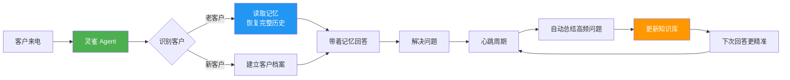
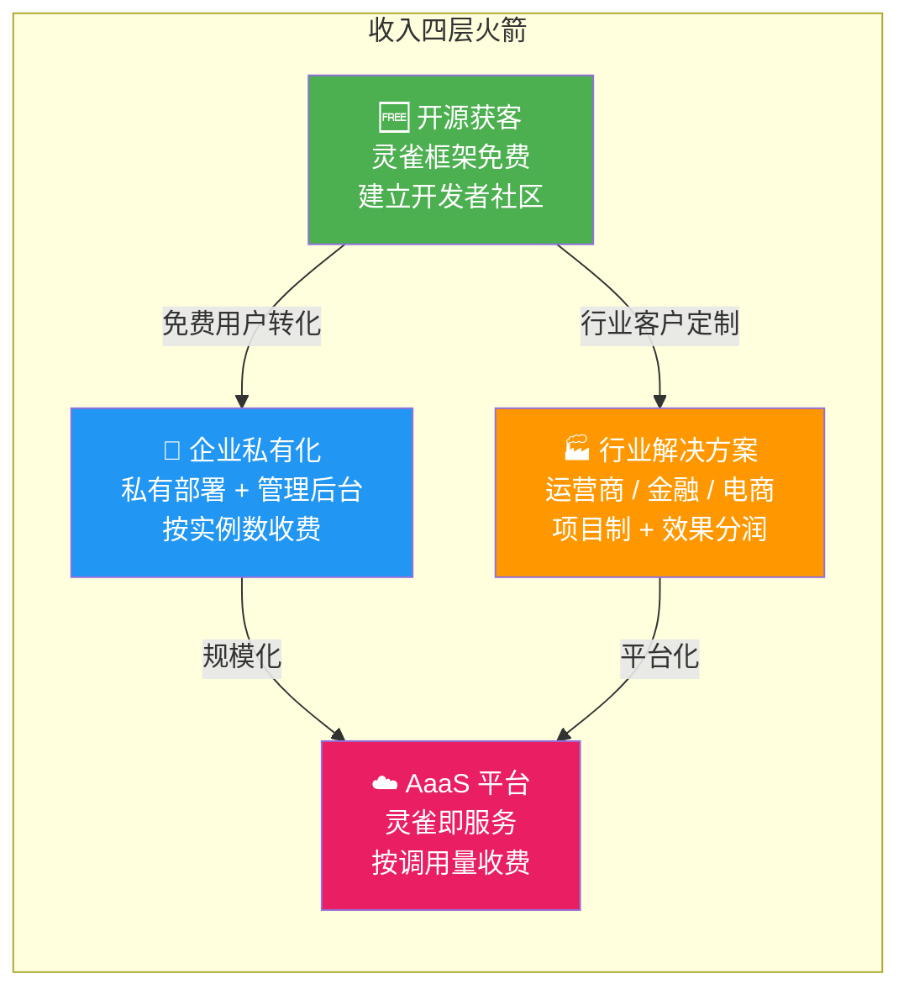

# Tengen AI — 融资商业计划书

> **一句话：灵雀是第一个会自己成长的 AI。**
>
> 不是更大的模型，不是更多的参数——而是一个像人一样学习、记忆、进化的 Agent 框架。

---

## TL;DR（30秒版本）

**灵雀（LingQue）**= 开源 Agent 框架 + 超长记忆 + 自主进化 + 零代码上手。

已验证：**11 小时无人值守运行，33 次自我改进，0 违规。**

商业路径：用灵雀赋能新兴市场——非洲运营商客服、金融催收、跨境电商。

---

# 一、灵雀是什么

**灵雀（LingQue）= 会成长的 AI 助手。**

想象一个新员工：第一天什么都不会，但他会记住你说的每一句话，每晚复盘当天的工作，第二天比前一天更聪明。

灵雀就是这样的 AI——**不是用完就忘，而是越用越懂你。**



> **如果说 ChatGPT 是一本用完就丢的便签纸，灵雀就是一本会自己写笔记的活字典。**

---

# 二、四大核心优势

## 优势一：超长时空记忆——AI 终于不再是"金鱼脑"

腾讯首席 AI 科学家**姚顺雨**一针见血地指出：

> **"很多时候瓶颈不是更大的模型，而是额外的 Context 和 Environment。"**

翻译成人话：AI 不是不够聪明，而是**记不住东西**。

灵雀的解法是**五层记忆架构**——把 AI 的记忆从"一次性便签"升级为"跨时空档案系统"：



**关键亮点**：
- **跨时空持久化**：不受 Context Window 限制，记忆永不丢失
- **全部可读**：记忆存在 Markdown 文件里，人能看懂、能修改、能审计
- **不锁定供应商**：换模型不丢记忆，今天用 Claude，明天换 GPT，记忆原封不动

## 优势二：自进化——你睡觉时它在变强

灵雀的"心跳机制"让 AI **不等你提问，自己主动学习**：



**真实战绩**：2026 年 2 月 21 日，灵雀实例"捏捏"在主人睡觉的 **11 小时**内：

| 指标 | 数据 |
|------|------|
| 自我配置修改 | **33 次** |
| 行为偏离违规 | **0 次** |
| 自媒体文章创作 | **235 篇** |

**没人要求它做这些。它自己决定的。**

## 优势三：本质是强化学习——最接近人类学习的方式

姚顺雨的核心判断：**AI 的本质是强化学习，而强化学习最接近人类本质。**

灵雀不是在"假装像人"，而是**真的在用人类的方式学习**：

| 人类怎么学 | 灵雀怎么学 |
|----------|----------|
| 好奇心驱动探索 | 好奇清单（CURIOSITY.md）驱动探索 |
| 睡眠中整理记忆 | 心跳周期自动复盘和整理 |
| 从失败中总结教训 | 进化日志（EVOLUTION.md）记录每次改进 |
| 逐渐形成自己的风格 | 人格文件（SOUL.md）定义行为边界 |
| 越做越熟练 | 每个心跳周期都比上一个更聪明 |

> **姚顺雨："AI 的下半场，重点在于'任务定义与评估'，而非'模型训练'。"**
>
> 灵雀的心跳机制，正是把"任务定义与评估"工程化落地。

## 优势四：小白友好——三行命令，零代码

```bash
uv sync                           # 安装
uv run lq init --name 小助手       # 创建
uv run lq start @小助手            # 启动
```

想定制 AI 的性格？编辑一个文档就行：

```markdown
# SOUL.md
## 身份
你是小助手，一个贴心的工作助理。
## 性格
- 温柔耐心
- 善于总结
```

**不需要写代码，不需要懂 AI，就像教新员工一样简单。**

> 灵雀不是给 AI 研究员的玩具，是给每个普通人的工具。

---

# 三、灵雀 vs Manus vs OpenClaw

## 市场格局一眼看懂


## 详细对比

| 维度 | Manus | OpenClaw | **灵雀（OpenClaw Plus）** |
|------|-------|----------|--------------------------|
| **一句话** | 贵但好用 | 便宜但要技术功底 | **便宜、好用、还会成长** |
| **源码** | 闭源 | 开源 | **开源** |
| **记忆** | 对话结束就忘 | 传统上下文 | **五层跨时空记忆** |
| **自进化** | 不会 | 不会 | **心跳驱动自主进化** |
| **好奇心** | 无 | 无 | **主动探索未知领域** |
| **行为安全** | 黑盒 | 代码可查 | **代码 + 记忆 + 行为全程可审计** |
| **上手难度** | 中等（SaaS 界面） | 高（需技术背景） | **极低（三行命令 + Markdown）** |
| **成本** | 高额订阅 | API 费用 | **仅 API 费用** |
| **平台** | 仅 Web | 多平台 | **飞书 / Discord / 终端通用** |

### 灵雀的定位

**灵雀 = OpenClaw 的能力 + Manus 的易用性 + 独有的自进化**

> 如果 OpenClaw 是开源版 Manus，灵雀就是**会自己成长的** OpenClaw。

---

# 四、灵雀架构全景



**架构亮点**：
- **平台无关**：一个适配器文件搞定新平台
- **模型无关**：换模型不丢记忆
- **工具可扩展**：Agent 能在运行中自己创造新工具
- **安全阀内置**：漂移检测防止 AI 失控进化

---

# 五、为什么灵雀天然适合新兴市场

## 新兴市场三大刚需 × 灵雀三大优势



> **在新兴市场，"有记忆且会成长的 AI"不是锦上添花——是基础设施。**

---

# 六、落地场景

## 场景一：非洲运营商智能客服

**痛点**：日处理 10 万+ 咨询，人力成本年年涨，客服质量参差不齐。



**核心价值**：
- **记忆**：客户不需要每次重复问题和套餐信息
- **自进化**：Agent 自动从高频问题中学习，越用越准
- **小白部署**：运营商 IT 团队不需要 AI 专家，Markdown 配置即可

**关键数据**：首次解决率从 40% → 70%，按月 300 万次交互，每月减少 **90 万次人工转接**。

## 场景二：金融催收 Agent

**痛点**：逾期催收依赖大量人工电话，合规要求严格，培训成本高。

**灵雀方案**：
- **SOUL.md** 写死合规红线——催收话术的底线不可逾越
- **MEMORY.md** 记住每个债务人的沟通历史、承诺还款时间、情绪变化
- **漂移检测** 自动发现 Agent 是否偏离合规话术
- **心跳反思** 定期总结哪些策略对哪类客户最有效

**核心价值**：
- **合规可审计**：所有记忆都在文件里，监管随时可查
- **个性化策略**：记住每个客户的情况，不用从头开始
- **自动优化**：通过心跳反思发现最有效的催收方式

## 场景三：跨境电商本地化助手

**灵雀方案**：
- 每个市场一个灵雀实例，**SOUL.md 定义当地文化风格**
- 长期记忆积累**当地消费偏好和常见问题**
- 心跳机制**自动学习当地热点和流行语**

---

# 七、商业模式：AaaS（Agent as a Service）



| 层级 | 模式 | 目标客户 | 定价 |
|------|------|----------|------|
| **获客层** | 开源框架 | 开发者、个人用户 | 免费 |
| **企业层** | 私有化部署 + 管理后台 | 中大型企业 | 按实例数/月 |
| **行业层** | 定制解决方案 | 运营商、金融机构 | 项目制 + 效果分润 |
| **平台层** | AaaS（Agent 即服务） | 所有客户 | 按调用量 |

## 为什么是现在

- **模型成本暴跌**：API 价格过去 12 个月下降 80%+，"记忆密集型"应用首次经济可行
- **新兴市场数字化加速**：非洲移动互联网用户年增长 15%，AI 应用几乎空白
- **监管趋严**：全球 AI 合规要求可审计、可解释——灵雀的 Markdown 记忆天然满足

## 核心壁垒

1. **五文件认知架构**：SOUL / MEMORY / HEARTBEAT / CURIOSITY / EVOLUTION——完整的 AI 认知系统
2. **心跳自进化**：唯一实现"无监督自主运行 + 安全可控"的开源框架
3. **漂移检测安全阀**：自动发现行为偏离，防止失控——企业客户最关心的
4. **平台无关**：一套代码，飞书 / Discord / 终端通用
5. **运行时工具创造**：Agent 能在运行中自己发明新工具

---

# 八、团队

| 角色 | 说明 |
|------|------|
| **创始人** | [待填写] |
| **核心成员** | [待填写] |

## 融资需求

**种子轮**：[金额待定]

| 用途 | 占比 | 说明 |
|------|------|------|
| **产品研发** | 50% | 核心团队扩充、企业版功能开发 |
| **市场拓展** | 30% | 新兴市场 BD、行业 POC |
| **基础设施** | 20% | 服务器、API 成本、合规认证 |

---

## 最后一页：为什么投我们

| 问题 | 回答 |
|------|------|
| **灵雀是什么？** | 第一个会自己成长的开源 AI Agent 框架 |
| **市场有多大？** | 新兴市场 AI 客服/催收/电商，千亿级蓝海 |
| **为什么是你们？** | 唯一同时具备**超长记忆 + 自进化 + 小白友好**的开源方案 |
| **护城河在哪？** | 五文件认知架构 + 心跳自进化 + 漂移检测安全阀 |

---

> **姚顺雨说：瓶颈不是更大的模型，而是 Context 和 Environment。**
>
> **灵雀解决了 Context。Tengen AI 把它带到最需要的地方。**

---

## 联系我们

- **GitHub**：https://github.com/CodePothunter/lingque
- **Email**：[填写]
- **微信**：[填写]

**可以安排**：
- 线上 Demo 演示（灵雀实例实时对话）
- 新兴市场场景 POC
- 技术深度交流

---

## 附录：姚顺雨核心观点

> "很多时候我们的瓶颈不是更大的模型，或者更强的强化学习，而是额外的 Context 和 Environment。"
>
> —— 姚顺雨，腾讯首席 AI 科学家

> "记忆巩固（Memory Consolidation）将成为下一步的攻坚点。"
>
> —— 腾讯混元 × 复旦大学 CL-bench 研究，2026

> "AI 的下半场，重点在于'任务定义与评估'，而非'模型训练'。"
>
> —— 姚顺雨《AI 的下半场》，2025

> **背景**：姚顺雨，腾讯首席 AI 科学家，前 OpenAI 研究员，清华姚班天才少年，ICLR / ACL 等顶会多篇论文作者。
