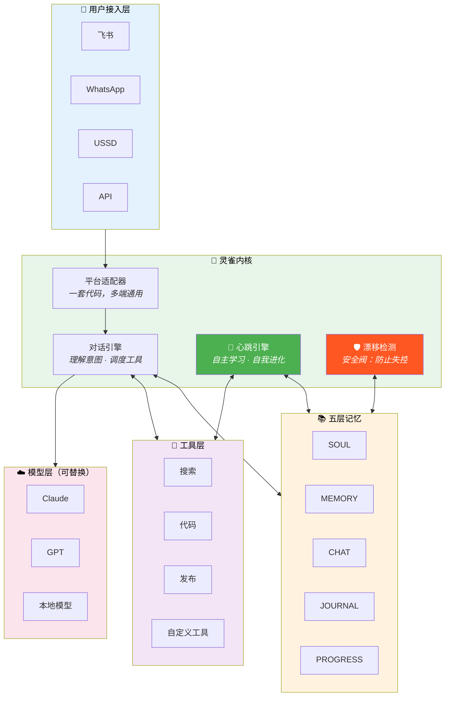
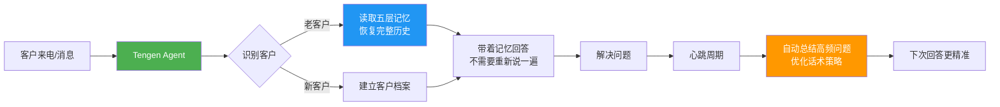
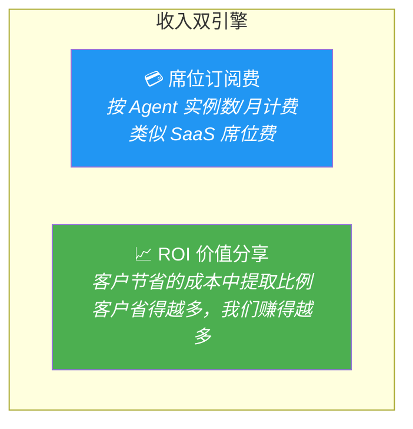
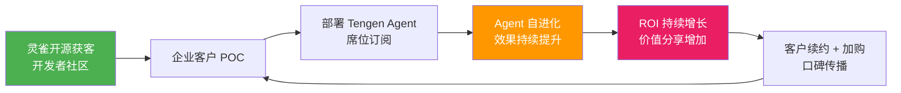
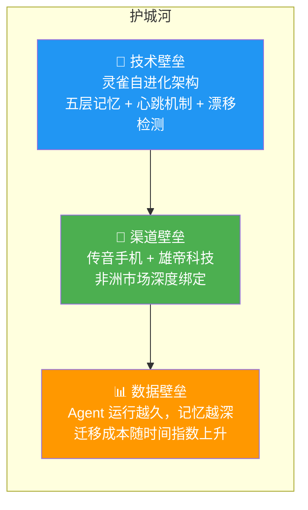

# Tengen AI（天元）— 投资人沟通材料

> **人海战术正在崩塌。我们建造替代它的东西。**

---

## 一句话

**10万名员工 = 10万种执行标准 + 无尽的培训 + 道德腐败。**

Tengen AI 提供一种全新选择：**不需要工资、永不疲倦、100% 执行标准、且能自我进化的全能型 AI Agent。**

技术底座：**灵雀（LingQue）**——第一个会自己成长的开源 Agent 框架。

---

## TL;DR

| 维度 | 答案 |
|------|------|
| **我们做什么** | 用 AI Agent 替代新兴市场的人海战术 |
| **技术底座** | 灵雀（OpenClaw Plus）—— 超长记忆 + 自进化 + 强化学习 + 小白友好 |
| **目标客户** | 非洲运营商、新兴市场金融机构 |
| **商业模式** | AaaS（Agent as a Service）：席位订阅费 + ROI 价值分享 |
| **核心 ROI** | 1000 人团队人力成本 1200 万/年 → Tengen Agent **192 万/年**，降低 **84%** |
| **护城河** | 传音手机 + 雄帝科技渠道壁垒 + 灵雀自进化技术壁垒 |

---

# 第一章：问题——人海战术的崩塌

## 新兴市场的现实

非洲最大的移动运营商，员工超过 **10 万人**。

这 10 万人意味着什么？

| 痛点 | 具体表现 |
|------|----------|
| **10 万种执行标准** | 每个客服人员对同一个问题有不同的回答 |
| **无尽的培训** | 新产品上线 → 培训 3 个月 → 刚学会 → 又换了 |
| **道德腐败** | 套餐推荐按回扣走，不按客户需求走 |
| **人员流动** | 年离职率 30%+，知识随人走，客户体验归零 |
| **质量黑盒** | 100 万通电话，只能抽检 1%，99% 是盲区 |

> **人海战术不是不好——是撑不住了。**

## 数字比故事更有说服力

一个典型的非洲运营商客服中心：

| 指标 | 数据 |
|------|------|
| 客服团队规模 | 1,000 人 |
| 人均年成本（含培训、管理） | 1.2 万美元 |
| 年总人力成本 | **1,200 万美元** |
| 首次解决率 | **40%**（60% 需要转接或回拨） |
| 客户满意度 | 偏低，主要投诉"每次要重新说一遍" |

---

# 第二章：灵雀——Tengen AI 的技术底座

> 如果说 Tengen AI 是一支军队，灵雀就是它的武器系统。

## 灵雀是什么

**灵雀（LingQue）= OpenClaw Plus = 会自己成长的 AI Agent 框架。**

腾讯首席 AI 科学家、前 OpenAI 研究员、清华姚班天才少年**姚顺雨**说：

> **"Context 是 AI 的阿喀琉斯之踵。"**
>
> "很多时候瓶颈不是更大的模型，而是额外的 Context 和 Environment。"

翻译成投资人能听懂的话：**现在的 AI 不是不聪明，是记不住东西、不会自己成长。**

灵雀解决的就是这两个问题。

## 灵雀四大优势

### 优势一：超长 Context——AI 终于不再"用完就忘"

姚顺雨的研究揭示：**当 Context 过长时，即使 GPT-5.1 也只有 23.7% 正确率。**

灵雀的解法不是硬扩 Context Window，而是构建**五层记忆架构**：

| 层级 | 文件 | 类比人类 | 作用 |
|------|------|----------|------|
| 性格层 | SOUL.md | 人的价值观 | 定义行为底线，不可逾越 |
| 记忆层 | MEMORY.md | 人的一生所学 | 全局长期记忆，跨时空持久化 |
| 对话层 | Chat Memory | 这段对话 | 当前交互的上下文 |
| 反思层 | Daily Journal | 人的日记 | 每日自动复盘 |
| 任务层 | PROGRESS.md | 人的待办 | 进度追踪，不遗漏 |

**关键区别**：这些记忆存在 Markdown 文件里——**人能看懂、能修改、能审计、能迁移**。不锁定任何模型供应商。

### 优势二：自进化——你睡觉时它在变强

灵雀的**心跳机制**让 AI 不等用户提问，自主学习和改进：

```
心跳唤醒 → 恢复记忆 → 自主选择任务（学习/创作/改进/反思）
    → 执行 → 发现知识盲区 → 记入好奇清单 → 下次心跳继续学
```

**真实战绩**：2026 年 2 月 21 日，灵雀实例"捏捏"在主人睡觉的 **11 小时**内：

| 指标 | 数据 |
|------|------|
| 自我配置修改 | **33 次** |
| 行为偏离违规 | **0 次** |
| 自媒体文章创作 | **235 篇** |

**没人要求它做这些。它自己决定的。这就是自进化。**

### 优势三：本质是强化学习——最接近人类学习的方式

姚顺雨的核心判断：**AI 的本质是强化学习，而强化学习最接近人类本质。**

| 人类怎么学 | 灵雀怎么学 |
|------------|------------|
| 好奇心驱动探索 | CURIOSITY.md 驱动探索未知 |
| 睡眠中整理记忆 | 心跳周期自动复盘整理 |
| 从失败中总结教训 | EVOLUTION.md 记录每次改进 |
| 逐渐形成自己的风格 | SOUL.md 定义行为边界 |
| 越做越熟练 | 每个心跳周期都比上一个更聪明 |

灵雀不是"假装像人"，而是**真的在用人类的方式学习**。

> **"AI 的下半场，重点在于'任务定义与评估'，而非'模型训练'。"**
> —— 姚顺雨

灵雀的心跳机制，正是"任务定义与评估"的工程化落地。

### 优势四：小白友好——三行命令，零代码

```bash
uv sync                           # 安装
uv run lq init --name 客服小天      # 创建 Agent
uv run lq start @客服小天           # 启动
```

想定制 Agent 的行为？编辑一个 Markdown：

```markdown
# SOUL.md
## 身份
你是运营商客服 Agent，服务非洲市场。
## 红线
- 绝不推荐客户不需要的套餐
- 遇到投诉立即升级，不自行处理
```

**不需要 AI 工程师，不需要写代码。运营商的 IT 团队就能部署。**

---

# 第三章：竞品对比——Manus vs OpenClaw vs 灵雀


| 维度 | Manus | OpenClaw | **灵雀（OpenClaw Plus）** |
|------|-------|----------|--------------------------|
| **一句话** | 贵但好用 | 便宜但要技术功底 | **便宜、好用、还会成长** |
| **源码** | 闭源 | 开源 | **开源** |
| **记忆** | 对话结束就忘 | 传统上下文 | **五层跨时空记忆** |
| **自进化** | ❌ 不会 | ❌ 不会 | ✅ **心跳驱动自主进化** |
| **好奇心** | ❌ 无 | ❌ 无 | ✅ **主动探索未知领域** |
| **行为安全** | 黑盒 | 代码可查 | **代码 + 记忆 + 行为全程可审计** |
| **上手难度** | 中（SaaS 界面） | 高（需技术背景） | **极低（三行命令 + Markdown）** |
| **成本** | 高额订阅 | API 费用 | **仅 API 费用** |
| **供应商锁定** | 锁定 | 部分 | **零锁定，换模型不丢记忆** |

> **灵雀 = OpenClaw 的能力 + Manus 的易用性 + 独有的自进化。**

---

# 第四章：灵雀技术架构



**架构关键词**：平台无关 · 模型无关 · 记忆持久化 · 安全阀内置 · 运行时自扩展

---

# 第五章：落地——新兴市场的人海战术替代方案

## 场景一：非洲运营商智能客服

**现状**：日处理 10 万+ 咨询，客服 1000 人，年人力成本 1200 万美元。

**Tengen Agent 方案**：



**效果预测**：

| 指标 | 人海模式 | Tengen Agent |
|------|----------|--------------|
| 首次解决率 | 40% | **70%+** |
| 客户重复描述问题 | 每次都要 | **永远不需要** |
| 月人工转接次数 | 180 万次 | **减少 90 万次** |
| 年人力成本 | 1,200 万美元 | **192 万美元** |
| **成本降幅** | — | **84%** |

## 场景二：金融催收 Agent

**痛点**：逾期催收依赖大量人工电话，合规要求严格，培训成本高，道德风险大。

**灵雀方案**：
- **SOUL.md** 写死合规红线——催收话术的底线硬编码，不可逾越
- **MEMORY.md** 记住每个债务人的沟通历史、承诺还款时间、情绪变化
- **漂移检测** 100% 覆盖，自动发现 Agent 是否偏离合规话术
- **心跳反思** 定期总结哪些策略对哪类客户最有效

**核心价值**：合规可审计（监管随时可查） + 个性化策略 + 零道德腐败。

---

# 第六章：商业模式——AaaS（Agent as a Service）

## 收入模型：席位订阅费 + ROI 价值分享



## ROI 测算（以 1000 人客服中心为例）

| 项目 | 人海模式 | Tengen Agent | 节省 |
|------|----------|--------------|------|
| 年人力成本 | 1,200 万美元 | — | — |
| Agent 席位订阅费 | — | 120 万美元 | — |
| API 调用成本 | — | 72 万美元 | — |
| **年总成本** | **1,200 万** | **192 万** | **1,008 万** |
| **降幅** | — | — | **84%** |

**ROI 价值分享**：从客户节省的 1,008 万中提取 10-20%，即 **100-200 万美元/客户/年**。

## 增长飞轮



> **灵雀的自进化机制让 ROI 随时间自动增长——Agent 用得越久，越聪明，客户省得越多，我们赚得越多。**

---

# 第七章：护城河

## 三层壁垒



### 渠道壁垒：传音 + 雄帝

| 合作伙伴 | 优势 | 对 Tengen 的意义 |
|----------|------|------------------|
| **传音手机（Transsion）** | 非洲手机市场占有率 **48%**，覆盖 70+ 国家 | 预装渠道 + 运营商关系网 |
| **雄帝科技** | 非洲金融 IT 基础设施服务商，服务多国央行和商业银行 | 金融场景直达 + 合规背书 |

> **别人想进非洲市场要从零开始。我们有传音的手机渠道和雄帝的金融网络——这是花钱买不到的。**

### 技术壁垒：灵雀的不可复制性

灵雀不是一个功能点，而是**一整套认知架构**：

1. **五文件认知系统**：SOUL / MEMORY / HEARTBEAT / CURIOSITY / EVOLUTION——缺一不可
2. **心跳自进化**：唯一实现"无监督自主运行 + 安全可控"的开源框架
3. **漂移检测安全阀**：自动发现行为偏离，企业客户最关心的信任基础
4. **运行时工具创造**：Agent 能自己发明新工具，能力边界自动扩展

### 数据壁垒：时间的朋友

Agent 运行时间越长 → 记忆越深 → 服务越精准 → 迁移成本越高。

**这不是技术锁定，是价值锁定——客户不想走，因为换了就丢了所有积累。**

---

# 第八章：团队

| 角色 | 背景 |
|------|------|
| **创始人 / CEO** | [待填写] |
| **CTO** | [待填写] |
| **非洲市场负责人** | [待填写] |
| **核心技术团队** | [待填写] |

### 顾问网络

| 顾问 | 价值 |
|------|------|
| 传音手机相关资源 | 非洲运营商渠道引荐 |
| 雄帝科技相关资源 | 非洲金融客户引荐 |

---

# 第九章：融资需求

**种子轮**：[金额待定]

| 用途 | 占比 | 说明 |
|------|------|------|
| **产品研发** | 40% | 灵雀企业版开发、Agent 管理后台 |
| **市场拓展** | 35% | 非洲运营商 POC、金融客户 BD、传音/雄帝渠道落地 |
| **基础设施** | 15% | 服务器、API 成本、数据合规 |
| **团队建设** | 10% | 核心岗位招聘 |

### 里程碑

| 阶段 | 目标 |
|------|------|
| **M1** | 完成 1 家非洲运营商 POC，验证 ROI |
| **M2** | 签约 3 家付费客户（运营商 + 金融） |
| **M3** | Agent 实例突破 1000，月收入破百万 |

---

# 最后一页：为什么投 Tengen AI

| 问题 | 回答 |
|------|------|
| **你们解决什么问题？** | 新兴市场人海战术的崩塌——10 万人 = 10 万种标准 + 无尽培训 + 道德腐败 |
| **你们的方案是什么？** | 不需要工资、永不疲倦、100% 执行标准、且能自我进化的 AI Agent |
| **技术底座是什么？** | 灵雀——第一个会自己成长的开源 Agent 框架 |
| **ROI 有多大？** | 1000 人团队 1200 万/年 → 192 万/年，**降低 84%** |
| **护城河在哪？** | 灵雀自进化技术 + 传音手机渠道 + 雄帝金融网络 |
| **商业模式？** | 席位订阅费 + ROI 价值分享 |
| **为什么是现在？** | AI 成本暴跌 80% + 新兴市场数字化加速 + 人海战术成本不可持续 |

---

> **姚顺雨说："瓶颈不是更大的模型，而是 Context 和 Environment。"**
>
> **灵雀解决了 Context。Tengen AI 把它带到最需要的地方——用 AI Agent 终结人海战术。**

---

## 联系我们

- **GitHub**：https://github.com/CodePothunter/lingque
- **Email**：[填写]
- **微信**：[填写]

**可以安排**：
- 线上 Demo 演示（灵雀实例实时对话）
- 非洲运营商场景 POC
- 技术深度交流

---

## 附录：姚顺雨核心观点

> **背景**：姚顺雨，腾讯首席 AI 科学家，前 OpenAI 研究员，清华姚班天才少年，ICLR / ACL 等顶会多篇论文作者。

> "Context 是 AI 的阿喀琉斯之踵。"

> "很多时候我们的瓶颈不是更大的模型，或者更强的强化学习，而是额外的 Context 和 Environment。"

> "记忆巩固（Memory Consolidation）将成为下一步的攻坚点。"
> —— 腾讯混元 × 复旦大学 CL-bench 研究，2026

> "AI 的下半场，重点在于'任务定义与评估'，而非'模型训练'。"
> —— 姚顺雨《AI 的下半场》，2025

灵雀的 Memory 架构（SOUL.md + MEMORY.md + CURIOSITY.md）正是对姚顺雨 Context 问题的工程化解答。心跳机制 + 漂移检测 + 好奇心驱动的自进化，让 Agent 真正接近人类学习本质。
