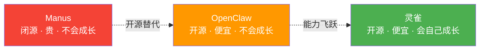
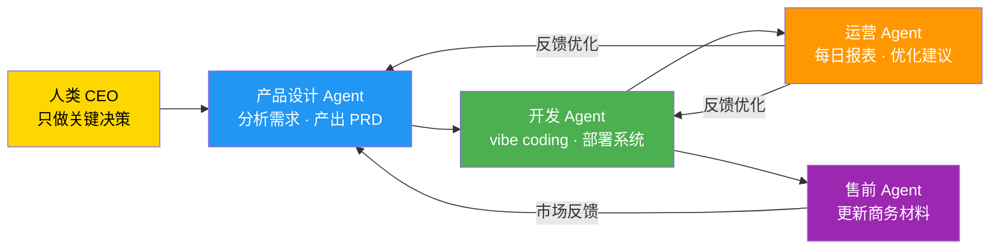
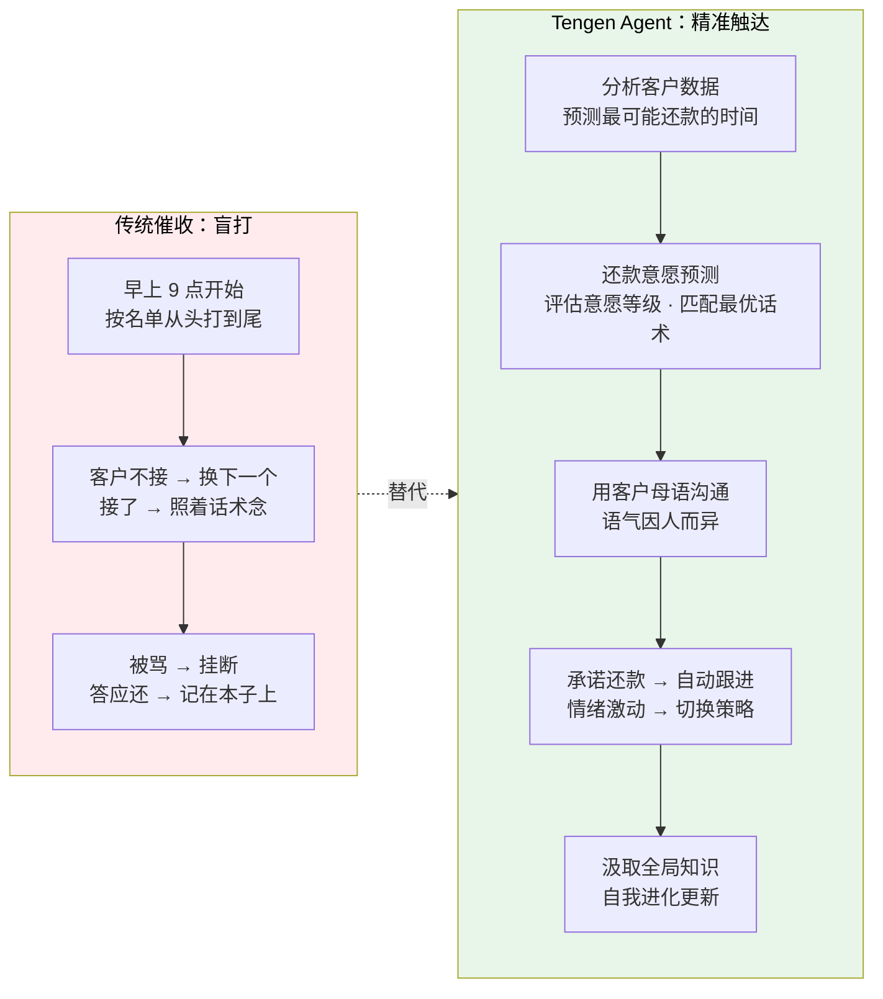
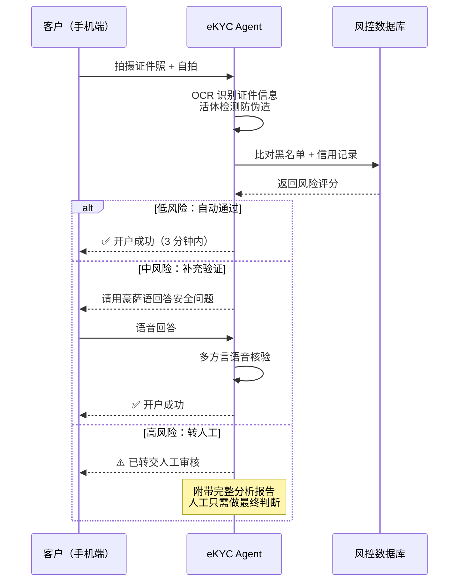

# Tengen AI（天元）— 投资人沟通材料

> **人海战术正在崩塌。我们建造替代它的东西。**

---

10万员工 = 10万个大爷。管理累、培训贵、执行乱。

Tengen AI 给你另一种可能：不发工资、不用休息、指哪打哪、越用越聪明的 AI 员工。

底层靠灵雀——唯一会自己进化的 Agent 框架。

---

## TL;DR

| 维度 | 答案 |
|------|------|
| **我们做什么** | 用 AI Agent 替代新兴市场的人海战术 |
| **技术底座** | 灵雀（OpenClaw Plus）—— 超长记忆 + 自进化 + 迁移学习 + 小白友好 |
| **目标客户** | 新兴市场金融机构、运营商、出海企业 |
| **商业模式** | AaaS（Agent as a Service）：席位订阅费 + ROI 价值分享 |
| **核心 ROI** | 1000 人团队人力成本 2400 万/年 → Tengen Agent **192 万/年**，降低 **92%** |
| **护城河** | 传音手机 + 雄帝科技渠道壁垒 + 灵雀自进化技术壁垒 |

---

# 第一章：灵雀——Tengen AI 的技术底座

> 如果说 Tengen AI 是一支军队，灵雀就是它的武器系统。

## 灵雀是什么

**灵雀（LingQue）= OpenClaw 工业升级版 = 会自己成长的 AI Agent 框架。**

腾讯首席 AI 科学家、前 OpenAI 研究员、清华姚班天才少年**姚顺雨**说：

> **"Context 是 AI 的阿喀琉斯之踵。"**
>
> "很多时候瓶颈不是更大的模型，而是额外的 Context 和 Environment。"

换句话说就是：**现在的 AI 不是不聪明，是记不住东西、不会自己成长。**

灵雀就是治愈*阿喀琉斯之踵*的灵药。

## 灵雀五大优势

### 优势一：跨时空超长 Context——AI 终于不再"用完就忘"

姚顺雨的研究揭示：**当 Context 过长时，即使 GPT-5.1 也只有 23.7% 正确率。**

灵雀的解法不是硬扩 Context Window，而是构建**五层记忆架构**：

| 层级 | 文件 | 类比人类 | 作用 |
|------|------|----------|------|
| 性格层 | SOUL.md | 人的价值观 | 定义行为底线，不可逾越 |
| 记忆层 | MEMORY.md | 人的一生所学 | 全局长期记忆，跨时空持久化 |
| 对话层 | Chat Memory | 这段对话 | 当前交互的上下文 |
| 反思层 | Daily Journal | 人的日记 | 每日自动复盘 |
| 任务层 | PROGRESS.md | 人的待办 | 进度追踪，不遗漏 |

**关键区别**：这些记忆存在 Markdown 文件里——**人能看懂、能修改、能审计、能迁移**。不锁定任何模型供应商。

### 优势二：自进化——你睡觉时它在变强

灵雀的**心跳机制**让 AI 不等用户提问，自主学习和改进：

```
心跳唤醒 → 恢复记忆 → 自主选择任务（学习/创作/改进/反思）
    → 执行 → 发现知识盲区 → 记入好奇清单 → 下次心跳继续学
```

**真实战绩**：2026 年 2 月 21 日，灵雀实例"捏捏"在主人休息睡觉的 **11 小时**内：

| 指标 | 数据 |
|------|------|
| 自我配置修改 | **33 次** |
| 行为偏离违规 | **0 次** |
| 自媒体文章创作 | **235 篇** |

**没人要求它做这些。它自己决定的。这就是自进化。**

### 优势三：迁移学习——一个人学会，所有人都会

这是灵雀记忆架构的**内生能力**，不需要额外开发任何机制。

因为灵雀的全部知识都沉淀在 Markdown 文件里（SOUL.md、MEMORY.md……），迁移经验就像复制文件一样简单——**复制一份记忆给新 Agent，或者让老 Agent 直接"带教"新 Agent**。

> **举个例子**：你在尼日利亚部署了一个催收 Agent，它花了 3 个月学会了"豪萨语客户更愿意在发薪日后第三天还款"。现在你要进入坦桑尼亚市场——传统做法是重新招人、重新培训、从零开始。灵雀的做法是：**把尼日利亚 Agent 的记忆文件复制一份给坦桑尼亚 Agent**，它第一天上岗就带着 3 个月的经验。不需要写代码，不需要训练模型——复制粘贴，完事。


**为什么这是内生能力？**

| 传统 AI 的迁移学习 | 灵雀的联邦迁移学习 |
|-------------------|---------------|
| 需要专门的联邦学习框架 | **记忆就是 Markdown 文件，天然安全可审查复制** |
| 需要 AI 工程师介入 | **运营人员就能操作** |
| 模型重新训练，成本高 | **复制文件或让老 Agent 带教，零成本** |
| 跨区域数据合规复杂 | **只迁移策略和经验，不触碰原始数据** |

> **一个人学会了，所有人都会——不是因为我们做了什么特殊机制，而是灵雀的记忆架构天然支持这件事。**

### 优势四：本质是强化学习——最接近人类学习的方式

姚顺雨的核心判断：**AI 的本质是强化学习，而强化学习最接近人类本质。**

| 人类怎么学 | 灵雀怎么学 |
|------------|------------|
| 好奇心驱动探索 | CURIOSITY.md 驱动探索未知 |
| 睡眠中整理记忆 | 心跳周期自动复盘整理 |
| 从失败中总结教训 | EVOLUTION.md 记录每次改进 |
| 逐渐形成自己的风格 | SOUL.md 定义行为边界 |
| 越做越熟练 | 每个心跳周期都比上一个更聪明 |

灵雀不是"假装像人"，而是**真的在用人类的方式学习**。

> **"AI 的下半场，重点在于'任务定义与评估'，而非'模型训练'。"**
> —— 姚顺雨

灵雀的心跳机制，正是"任务定义与评估"的工程化落地。

### 优势五：小白友好——三行命令，零代码

```bash
uv sync                           # 安装
uv run lq init --name 客服小天      # 创建 Agent
uv run lq start @客服小天           # 启动
```

想定制 Agent 的行为？编辑一个 Markdown：

```markdown
# SOUL.md
## 身份
你是运营商客服 Agent，服务非洲市场。
## 红线
- 绝不推荐客户不需要的套餐
- 遇到投诉立即升级，不自行处理
```

**不需要 AI 工程师，不需要写代码。运营商的 IT 团队就能部署。**

---

# 第二章：竞品对比——Manus vs OpenClaw vs 灵雀



| 维度 | Manus | OpenClaw | **灵雀（OpenClaw Plus）** |
|------|-------|----------|--------------------------|
| **一句话** | 贵但好用 | 便宜但要技术功底 | **便宜、好用、还会成长** |
| **源码** | 闭源 | 开源 | **开源** |
| **记忆** | 对话结束就忘 | 传统上下文 | **五层跨时空记忆** |
| **自进化** | ❌ 不会 | ❌ 不会 | ✅ **心跳驱动自主进化** |
| **迁移学习** | ❌ 无 | ❌ 无 | ✅ **跨地区知识迁移，冷启动即可用** |
| **好奇心** | ❌ 无 | ❌ 无 | ✅ **主动探索未知领域** |
| **行为安全** | 黑盒 | 代码可查 | **代码 + 记忆 + 行为全程可审计** |
| **上手难度** | 中（SaaS 界面） | 高（需技术背景） | **极低（三行命令 + Markdown）** |
| **成本** | 高额订阅 | API 费用 | **仅 API 费用** |
| **供应商锁定** | 锁定 | 部分 | **零锁定，换模型不丢记忆** |

> **灵雀 = OpenClaw 的能力 + Manus 的易用性 + 独有的自进化 + 联邦迁移学习。**

---

## 灵雀能力落地：一人 AI 公司

> 一个人 + 灵雀 = 一个完整公司的能力

**场景**：你想做一个催收系统，但只有你一个人。

传统做法：招产品经理、开发、运营、售前……4 个人起步，管理成本高，沟通效率低。

**灵雀的做法**：创建 4 个 AI 员工，每个有独立的 SOUL，自动分工协作：

| AI 员工 | 职责 | 输出 |
|---------|------|------|
| **产品设计** | 分析用户需求、市场反馈 | 产品设计文档（PRD） |
| **开发部署** | vibe coding + 系统实现 | 可运行的催收系统 |
| **运营** | 每日报表、数据分析、优化建议 | 优化建议 → 反馈给产品和开发 |
| **售前** | 基于产品迭代更新商务材料 | 自动更新的 PPT、报价单 |



**自进化闭环**：
- 运营每天分析数据 → 发现问题 → 自动反馈给产品和开发
- 产品设计更新 PRD → 开发自动感知 → 系统迭代
- 售前根据产品更新 → 商务材料始终保持最新

**人类 CEO 只需做三件事**：
1. 定义公司方向（做什么产品）
2. 关键决策（定价、合作）
3. 线下触达（需要时招聘线下人员）

**对比传统公司**：

| 维度 | 传统公司 | 一人 AI 公司 |
|------|----------|--------------|
| 团队规模 | 4 人起步 | 1 人 + 4 个 AI |
| 管理成本 | 高（沟通、协调） | 零（AI 自动协作） |
| 迭代速度 | 周/月级 | 天级（每日自动优化） |
| 知识留存 | 人员流失 = 经验流失 | 记忆文件永久保存 |
| 扩展成本 | 招人 + 培训 | 复制记忆文件 |
| 多Agent协同 | 部门墙、信息孤岛 | AI 之间自动反馈、自主优化 |

> **这不是幻想，是灵雀多角色协作能力的具象化展示。**

---

# 第三章：灵雀技术架构


**架构关键词**：平台无关 · 模型无关 · 记忆持久化 · 安全阀内置 · 迁移学习 · 运行时自扩展

---

# 第四章：现在——正在发生的变革

> **传统人海战术撑不住了。我们已经在替代它。**

## 人海战术的困境

非洲最大的移动运营商，员工超过 **10 万人**。这 10 万人意味着什么？

| 痛点 | 具体表现 |
|------|----------|
| **10 万种执行标准** | 每个人对同一个问题有不同的回答 |
| **无尽的培训** | 新产品上线 → 培训 3 个月 → 刚学会 → 又换了 |
| **道德腐败** | 套餐推荐按回扣走，不按客户需求走 |
| **人员流动** | 年离职率 30%+，知识随人走，客户体验归零 |
| **质量黑盒** | 100 万通电话，只能抽检 1%，99% 是盲区 |

> **客户不再为"功能"买单，而是为"降低的确定性成本（人头费）"和"提升的确定性收益（转化率/回收率）"买单。**

## 商业模式：从工具收费到 ROI 收费

**AaaS（Agent as a Service）= 席位订阅费 + ROI 价值分享**


核心逻辑：**不卖软件，卖结果。客户省得越多，我们赚得越多。**

## 案例一：金融催收——让 AI 在对的时间说对的话（已实现）

非洲金融机构有数以千计的催收员，每天盲打电话。大部分电话打了没人接，接了被骂，骂完挂断。催收员流失率极高，合规风险极大。

**Tengen 催收 Agent 做的事情完全不同**：



**具体来说，Agent 做了六件人做不到的事**：

**1. 找到"黄金时间窗口"**——不再盲打，而是在客户最可能还款的时间点联系。比如发薪日后第三天，还款意愿最高。Agent 通过数据分析自动学会这个规律。

**2. 用"本地乡音"建立信任**——非洲一个国家可能有几十种方言。Agent 适配豪萨语、约鲁巴语、斯瓦希里语等多种方言，用客户最熟悉的语言沟通，回款意愿大幅提升。

**3. 记住每一次对话**——张三上次说"月底还"，Agent 记住了，月底准时跟进，不需要重新沟通。传统催收员可能已经离职了，新人来了从头开始。

**4. 实时情绪感知，动态调整策略**——通话过程中实时识别客户情绪变化，自动切换沟通策略。客户焦虑时放缓节奏、给出方案；客户抵触时降低施压、建立共情。传统催收员很难在高压环境下保持情绪敏感度。

**5. 预测还款意愿**——不只是预测时间，还预测客户的还款意愿等级，自动匹配不同语气和话术策略。传统催收员只能凭经验猜测，而 Agent 能从历史数据中精准预测。

**6. 汲取全局知识，自我进化更新**——Agent 对全量通话进行自动分析与质检，从中提炼高转化话术、识别低效策略，自动更新话术模板和催收策略。每一个实例的成功经验变成所有实例的集体智慧。

**覆盖区域**：尼日利亚、坦桑尼亚、加纳、科特迪瓦（即将上线巴基斯坦）。

**价值分享模式**：Agent 承担 **80%** 的标准催收任务，人力只处理复杂案件。从"席位订阅费"升级为**"席位费 + ROI 价值分享"**。

**每日质检闭环**：Agent 自动进行全量数据分析质检，替代传统 1% 抽检。发现异常话术、违规操作立即标记，形成优化闭环。

**越用越聪明——全局质检驱动的自进化闭环**：Agent 不仅执行催收，还能对全量或抽样通话进行自动分析与质检，从中提炼高转化话术、识别低效策略，进而**自动更新话术模板和催收策略**。每一通电话的结果都是学习素材——哪种开场白回款率最高？哪种语气最容易激怒客户？Agent 汲取全局知识，持续迭代。传统团队依赖"优秀员工分享经验"，而 Tengen Agent 把**每一个实例的成功经验变成所有实例的集体智慧**，真正实现越用越聪明、越用越精准。

### ROI 计算器：真实客户的经济账

客户在多个区域共有 1000 人催收团队：

| 项目 | 传统人工 | Tengen Agent |
|------|----------|--------------|
| 团队规模 | 1,000 人 | — |
| 年人力成本（人均 1.2 万含培训管理） | **1,200 万人民币/年（保守估计）** | — |
| Agent 年成本（16 万/月 × 12） | — | **192 万人民币/年** |
| **直接成本降幅** | — | **~92%** |

**不只是省钱——还有人做不到的事**：

| 维度 | 传统人工 | Tengen Agent |
|------|----------|--------------|
| 工作时间 | 8 小时/天，节假日休息 | **24/7 不间断** |
| 合规性 | 抽检 1%，99% 是盲区 | **100% 全量可审计** |
| 处理速度 | 一个催收员一天打 80 通电话 | **同时处理数千路对话** |
| 新市场扩张 | 重新招人培训，3 个月起步 | **复制记忆文件，第一天上岗** |
| 还款意愿预测 | 凭经验猜测 | **数据驱动，精准预测意愿等级** |
| 汲取全局知识 | 经验随人员流失 | **全量数据自动学习，越用越聪明** |

> **成本降低 92%——随着架构和 Cache 优化，还能继续降。**

## 案例二：非洲运营商智能客服（含 eKYC 探索）

非洲运营商客服现状：客户打来电话问套餐 → 客服手动查询 → 翻找半天 → 告诉结果 → 客户可能还是不懂……**一通电话平均 8 分钟，客户满意度低，投诉率高**。

**Tengen eKYC Agent 把这件事变成了这样**：



**关键点**：

| 传统 KYC | Tengen eKYC Agent |
|----------|-------------------|
| 柜员手动核对证件，容易疲劳出错 | **OCR + 活体检测，机器不会看走眼** |
| 只能处理本地证件类型 | **适配非洲/东南亚 20+ 种证件** |
| 审核经验锁在老员工脑子里 | **尼日利亚识别出的伪造手法，加纳 Agent 第二天就知道**（迁移学习） |
| 开户周期 3 天，丢单率 40%+ | **3 分钟内完成，客户留存率大幅提升** |
| 合规检查靠抽检 | **100% 自动合规，监管随时可查** |
| 身份验证能力（eKYC 探索中） | 正在探索 SIM 卡实名认证、电子身份核验等场景 |

> **eKYC 能力正在探索中**，除金融场景外，还可扩展到运营商实名认证、政府电子身份等多个维度。

### 不止 eKYC——全维度运营商 Agent 服务

eKYC 只是切入点。基于灵雀的自进化架构，Tengen 可以为运营商提供**多维度的 Agent 服务矩阵**：

| Agent 类型 | 场景 | 价值 |
|-----------|------|------|
| **套餐推荐 Agent** | 根据用户通话、流量、消费习惯，智能推荐最优套餐 | 提升 ARPU、降低用户流失 |
| **故障报修 Agent** | 用户报修网络故障，Agent 自动诊断、派单、跟进 | 缩短修复周期、提升满意度 |
| **账户管理 Agent** | 余额查询、充值引导、账单解释、套餐变更 | 替代大量重复性人工客服 |
| **交叉营销 Agent** | 基于用户画像推送增值服务（移动支付、保险、贷款） | 开辟运营商新收入来源 |

这些 Agent 共享灵雀的五层记忆架构和迁移学习能力——**一个国家的套餐推荐经验，可以快速迁移到另一个国家**；故障报修 Agent 在尼日利亚学到的常见网络问题模式，加纳的 Agent 也能立刻复用。对运营商而言，这不只是"多了几个 AI 客服"，而是**一整套可自进化、可迁移、可扩展的智能运营体系**。

## 增长飞轮


> **灵雀的自进化机制让 ROI 随时间自动增长——Agent 用得越久，越聪明，客户省得越多，我们赚得越多。**

---

# 第五章：未来——从降本到增收，智能获客

> **现在我们帮客户省钱。下一步，我们帮客户赚钱。**

## 我们的案例：Tesla 的启示

Tesla 通过 AI 驱动的精准营销（由 Tengen AI 提供技术支持），将**单辆车的销售成本从 10,000 美元降到 3,000 美元**——降幅 70%。

同样的事情正在所有行业发生。**获客和营销，是下一个被 AI Agent 重塑的万亿赛道。**

## 当前痛点：为什么传统广告投放撑不住了

| 痛点 | 具体表现 |
|------|----------|
| **人力成本高昂** | 资深投手薪资高、培养周期长；新人操作易出错，试错成本由公司承担 |
| **时效性瓶颈** | 人类无法 7×24 盯盘，周末/深夜流量高峰错失调整良机，未能及时止损 |
| **数据孤岛与经验流失** | 跨渠道数据难以打通；优化方法论随人员离职而流失，无法形成企业资产 |

> **核心洞察**：Agent 技术使得构建"不知疲倦、逻辑严密、自我迭代"的数字投放团队成为可能。

## 多 Agent 协作机制：智能体分工


每个 Agent 都是灵雀实例——有记忆、会进化、能迁移。**Strategy Agent 在 Meta 上学到的投放经验，可以迁移给 TikTok 的 Agent。**

## 跨媒体中控台：打破平台围墙


| 能力 | 说明 |
|------|------|
| **统一 API 封装** | 屏蔽 Meta/Google/TikTok 底层差异，标准化投放接口 |
| **跨渠道预算流转** | 实时监控各平台 ROAS，自动将预算从高成本平台挪至低成本平台 |
| **智能止损与扩量** | 全局视角的自动化规则引擎，7×24 毫秒级响应异常波动 |

## 全自动创意工坊：数据驱动的 AIGC 闭环

```
LLM 撰写文案 → Flux 生成图像 → 视频拼接 → 投放 → 读取数据
    → 发现"红色背景"转化高 → 自动批量生成红色系变体 → 再投放
```

| 能力 | 说明 |
|------|------|
| **多模态生成流水线** | 文案→图像→视频，一站式产出多语言素材 |
| **数据反馈迭代** | 不只是生成——系统读取投放数据，自动优化创意方向 |
| **品牌一致性控制** | 内置 RAG 知识库与 LoRA 模型，确保素材符合品牌 VI 和合规要求 |

## 差异化：我们 vs 媒体引擎 vs 传统代理

| 维度 | 媒体智能引擎（Google PMax / Meta Advantage+） | 传统广告代理（4A / 投手团队） | **Tengen Agent** |
|------|----------------------------------------------|-------------------------------|------------------|
| **利益立场** | 既当裁判又当运动员（消耗预算） | 按人头收费，效率越低赚越多 | **纯粹的买方代理（追求利润）** |
| **数据透明度** | 黑盒（Black Box） | 依赖人工报表 | **白盒（White Box + 归因解释）** |
| **决策视野** | 平台内局部最优 | 受限于团队经验 | **跨平台/全渠道全局最优** |
| **迭代速度** | 算法不可控 | 人工迭代，天级 | **自动迭代，分钟级** |
| **知识沉淀** | 锁在平台内 | 随人员流失 | **灵雀记忆体系，永久沉淀** |

> **从"降本"到"增收"——Tengen AI 的第二增长曲线。**

---

# 第六章：护城河

## 三层壁垒


### 渠道壁垒：传音 + 雄帝

| 合作伙伴 | 优势 | 对 Tengen 的意义 |
|----------|------|------------------|
| **传音手机（Transsion）** | 覆盖 **108 个国家和地区**，非洲市场占有率 **超过 50%** | 预装渠道 + 运营商关系网 |
| **雄帝科技** | 覆盖 **20 个非洲和东南亚国家**的身份证件采集和制证，服务主权国家政府和公民 | **政府授权 + 国家公民库** |

> **别人想进非洲市场要从零开始。我们有传音的手机渠道（108 国覆盖，非洲 50%+ 占有率）和雄帝的政府授权及公民库——这是花钱买不到的。**

### 技术壁垒：灵雀的不可复制性

灵雀不是一个功能点，而是**一整套认知架构**：

1. **五文件认知系统**：SOUL / MEMORY / HEARTBEAT / CURIOSITY / EVOLUTION——缺一不可
2. **心跳自进化**：唯一实现"无监督自主运行 + 安全可控"的开源框架
3. **内生迁移学习**：记忆即文件，复制即迁移——跨地区知识共享零成本，不触碰原始敏感数据
4. **漂移检测安全阀**：自动发现行为偏离，企业客户最关心的信任基础
5. **运行时工具创造**：Agent 能自己发明新工具，能力边界自动扩展

### 数据壁垒：时间的朋友

Agent 运行时间越长 → 记忆越深 → 服务越精准 → 迁移成本越高。

**这不是技术锁定，是价值锁定——客户不想走，因为换了就丢了所有积累。**

---

# 第七章：团队

### 创始人 & CEO

- 香港科技大学人工智能方向 PhD 毕业，现香港科技大学（广州）兼职副教授
- 曾任微众银行人工智能部特级人工智能顾问、副总经理，在 AI+金融 领域为上亿普惠金融用户上线提供几十款 AI+金融 产品
- 曾任百度人工智能副总监，发起主导 NLP 与 ML 算法的深度结合，通用人工智能 AGI 研发核心（陆奇主导，现文心一言），小度机器人创始人
- 广东省人工智能与机器人学会常务理事

### Co-founder & 首席科学家：杨强

- 香港理工大学 CAIO，人工智能高等研究院院长
- 国际人工智能界领军人物，加拿大工程院及加拿大皇家科学院两院院士
- 迁移学习（预训练模型）和联邦学习主要开创者和带头人
- 微众银行前 CAIO（Chief AI Officer）
- 第四范式公司联合创始人/董事，中国移动集团公司独立董事
- 香港人工智能学会主席，国际人工智能联合会（IJCAI）理事会前主席
- 香港科大计算机与工程系前讲席教授/系主任，华为诺亚方舟实验室创始主任
- 人工智能相关五大国际主流学会均入选 Fellow，且是华人首位 AAAI Fellow
- 近五年发表顶级国际期刊/论文 100 余篇，Google Scholar 引用 13 万余次（H 指数 139）
- 中国最好的计算机科学家排名第二（[Research.com 评选](https://research.com/scientists-rankings/computer-science/cn)）

---

# 第八章：融资需求

**种子轮**：[金额待定]

| 用途 | 占比 | 说明 |
|------|------|------|
| **产品研发** | 40% | 灵雀企业版开发、Agent 管理后台、迁移学习引擎 |
| **市场拓展** | 35% | 非洲运营商 POC、金融客户 BD、传音/雄帝渠道落地 |
| **基础设施** | 15% | 服务器、API 成本、数据合规 |
| **团队建设** | 10% | 核心岗位招聘 |

### 里程碑

| 阶段 | 目标 |
|------|------|
| **M1** | 完成 1 家非洲运营商 POC，验证 ROI |
| **M2** | 签约 3 家付费客户（运营商 + 金融） |
| **M3** | Agent 实例突破 1000，月收入破百万 |
| **M4** | 智能获客产品上线，开启第二增长曲线 |

---

# 最后一页：为什么投 Tengen AI

| 问题 | 回答 |
|------|------|
| **你们解决什么问题？** | 新兴市场人海战术的崩塌——10 万人 = 10 万种标准 + 无尽培训 + 道德腐败 |
| **你们的方案是什么？** | 不需要工资、永不疲倦、100% 执行标准、且能自我进化的 AI Agent |
| **技术底座是什么？** | 灵雀——第一个会自己成长、能迁移经验的开源 Agent 框架 |
| **ROI 有多大？** | 1000 人团队 2400 万/年 → 192 万/年，**降低 92%** |
| **护城河在哪？** | 灵雀自进化 + 迁移学习 + 传音手机渠道 + 雄帝金融网络 |
| **商业模式？** | 席位订阅费 + ROI 价值分享 |
| **现在做什么？** | 金融催收 + 运营商交叉转化，覆盖尼日利亚等 4 国 |
| **未来做什么？** | 智能获客——多 Agent 广告投放，从降本走向增收 |
| **为什么是现在？** | AI 成本暴跌 80% + 新兴市场数字化加速 + 人海战术成本不可持续 |

---

> **姚顺雨说："瓶颈不是更大的模型，而是 Context 和 Environment。"**
>
> **灵雀解决了 Context。Tengen AI 把它带到最需要的地方——用 AI Agent 终结人海战术。**

---

## 联系我们

- **GitHub**：https://github.com/CodePothunter/lingque
- **Email**：[填写]
- **微信**：[填写]

**可以安排**：
- 线上 Demo 演示（灵雀实例实时对话）
- 非洲运营商场景 POC
- 技术深度交流
